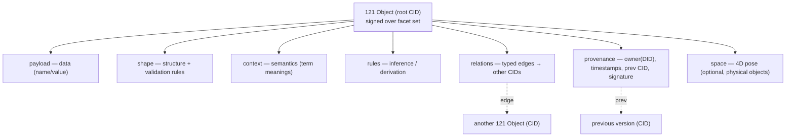

# 121XML v4 — The Self-Contained Semantic Object (SCSO)

**Author:** Claude Code (design collaboration with Rashad Khan)  ·  **Date:** 2026-08-19
**Status:** DESIGN DRAFT for review — addresses the shortcomings raised before publishing.
**Purpose:** evolve 121XML from "another self-describing format" into a defensible,
standards-aligned, self-verifying semantic object model — and a partnering strategy with SDOs.

---

## 1. The core move: an object is a *signed Merkle-DAG of content-addressed facets*

A **121 Object** is not one blob of fields. It is a small bundle of **facets**, each a canonical
121XML value with its own content address (CID). Facets are Merkle-linked; the root is signed.

**Root address** = hash over the alphabetically-sorted list of `{facetName: facetCID}` + provenance.
**One signature** over the root CID ⇒ the entire object is tamper-evident and owned.
**Version history** = a `prev`-CID chain ⇒ git-for-objects, immutable and auditable.

## 2. The facets (each defers to a best-in-class formalism — no reinvention)

| Facet | Carries | Delegate standard | Notes |
|---|---|---|---|
| `payload` | the data values | — | canonical 121XML (sorted keys, explicit null vs absent) |
| `shape` | structure **+ constraints/validation** | JSON Schema / SHACL / XSD | content-addressed ⇒ shared & versioned, dedup |
| `context` | **semantics** (what each key means) | JSON-LD `@context` | inlinable OR CID-referenced |
| `rules` | **inferences** (derive new facts) | Datalog / SHACL-AF / RETE | lets a receiver *reason*, not just read |
| `relations` | typed directed edges → other object CIDs | RDF triples / property graph | **this is the graph → drives 121ObjectMap natively** |
| `provenance` | **owner** (DID/public key), created/modified **timestamps**, `prev` CID, **signature** | W3C VC + DID, COSE (RFC 9052) / JWS, C2PA | the web3 / PKI ownership layer |
| `space` | **4D pose** for physical objects | OGC Moving Features, GeoJSON, MISB/STANAG 4609 (drone KLV) | position + orientation + valid-time + uncertainty |

### 2.1 `space` facet detail (4D, drone-grade)
- **position:** WGS84 (lat, lon, alt) or ECEF (x,y,z)
- **orientation:** quaternion (avoids gimbal lock)
- **valid-time:** instant or interval (ISO 8601)
- **frame:** reference-frame identifier
- **uncertainty:** covariance / accuracy radius
- Rationale: reuse OGC + MISB rather than invent coordinates; interoperable with GIS + drone stacks.

## 3. How this fixes each shortcoming

| Prior critique | Resolution in v4 |
|---|---|
| "Just another JSON; mechanisms already exist" | Not competing with JSON. The **composition** (facets + Merkle + signature + inline-or-reference + 4D) is the novel, defensible unit; each facet honestly delegates to a proven standard. |
| "90–96% compression conflated with the format" | Dedup is now **explicit & provable**: shared `shape`/`context`/`rules` stored once by CID. Publish a **measured dedup ratio** on real corpora, separate from the envelope. |
| "'No external namespace' not truly achieved" | **Inline-or-reference**: a facet may be embedded (fully self-contained) OR referenced by CID (compact; resolve local cache → peer → registry). Both verify to the **same hash**. Trade-off owned, not denied. |
| "Vertical conversion is semantic, not syntactic" | Each vertical standard = a **published profile** (`shape` + `context` + mapping). 121XML **wraps** FHIR/ISO 20022 as facets; never replaces them. |

## 4. Content addressing "at processor level" — MOVED to 121XMLSilicon

The hardware/processor-level track is **parked in its own project** so the software standard is
funded and pitched on its own terms (per diligence flag: silicon must not sit inside the software seed).

➡️ See **`F:\AI\.Claude\projects\121XMLSilicon\PROCESSOR_LEVEL_ROADMAP.md`** (+ that project's `README.md`).

One line to retain here for context: the software layer stays honest and hardware-independent —
**R4 determinism ⇒ single-pass canonical hashing**, and SHA-256 is already a CPU instruction
(Intel SHA-NI / ARMv8 crypto), so the software runtime needs no special hardware. Everything beyond
that (CAS runtime → DPU/CXL offload → FPGA proof → IP-licensable accelerator) is tracked in 121XMLSilicon.

## 5. Encoding & determinism

- Canonical binary encoding via **CBOR (RFC 8949)** deterministic profile, or Canonical JSON (**JCS / RFC 8785**) for text.
- CID via **multiformats/IPLD** (multihash + codec + version) rather than a bespoke `data://sha256:…` scheme —
  interoperable with the entire content-addressed ecosystem (IPFS, Git-like tools).
- Signatures via **COSE** (binary) or **JOSE/JWS** (text); provenance via **W3C Data Integrity proofs**.

## 6. Standards-body partnering playbook ("bigger membership, not a fight")

- **The pitch to each SDO:** *"121XML makes your standard AI-portable and content-verifiable —
  growing your adoption and membership."* Align incentives; offer them reach.
- **Open-govern the core** (permissive license; IETF/W3C/OGC-style process). A proprietary
  "revolutionary format" repels partners; an open, well-governed **profile** attracts them.
  → This is the single highest-impact change to current positioning.
- **Facet → home SDO (contribute back):**
  - shape/context → **W3C** (JSON Schema, SHACL, JSON-LD)
  - provenance → **W3C** (VC / DID / PROV) + **IETF** (COSE)
  - addressing/encoding → **multiformats/IPLD**, **IETF** (CBOR)
  - geo → **OGC** (Moving Features, GeoJSON); motion imagery → **MISB**
  - finance → **ISO TC68 / ISO 20022 Registration Authority**
  - health → **HL7 FHIR**
- Deliver **reference profiles** (e.g. `urn:121xml:fhir/R4`, `urn:121xml:iso20022/pain.001`) as
  community contributions; co-brand; seek a working-group note rather than a competing spec.

## 7. What to build first (spec-level, no deployment)
1. Write the **SCSO core spec** (facets, canonical encoding, CID scheme, signature, resolution).
2. Define the **`relations` facet schema** — it is also the native input to **121ObjectMap** (Tab 2).
3. Author **2 reference profiles** end-to-end (1 finance: ISO 20022 pain.001; 1 health: FHIR R4 patient)
   to prove the wrapping model and measure real dedup.
4. Draft **RELATED_STANDARDS.md** (candid lineage: CBOR, JCS, IPLD, JSON-LD, SHACL, VC/DID, COSE, OGC).
5. Measure a **real dedup ratio** on a sample corpus (pure software; SHA-256 via CPU crypto ext) so the
   compression claim becomes a verified number. *(Hardware acceleration of this lives in 121XMLSilicon.)*

---
*Design draft. Nothing published. For your red-line before it becomes the canonical v4 spec.*
