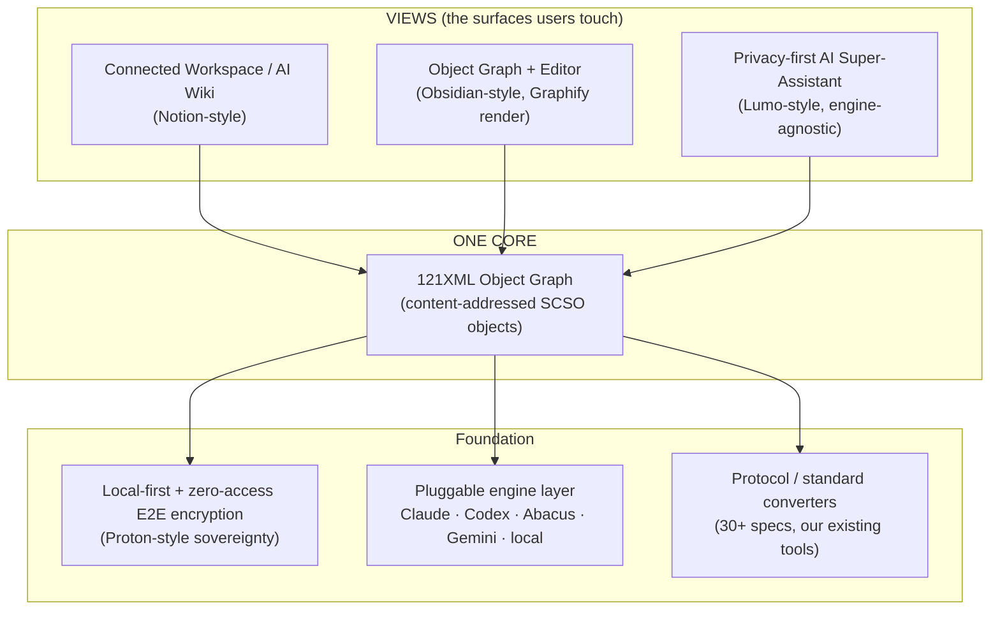
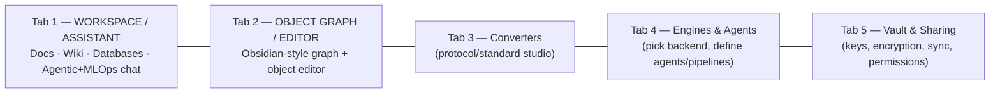

# 121XQ AI OS — Spec v5 (Synthesis Revision)

**Working title:** 121XQ — *The Sovereign AI Workspace on an Object-Addressable Standard*
**Author:** Claude Code (design collaboration with Rashad Khan) · **Date:** 2026-08-20
**Status:** DESIGN / SPEC DRAFT — supersedes the product-surface sections of
`121XML_AI_OS_MASTER_SPEC.md` and `121XML_AI_OS_FINAL_SPECIFICATIONS.md`.
Builds directly on the object model in `121XML_v4_SEMANTIC_OBJECT_DESIGN.md` (SCSO).
**Honesty note (per user directive):** everything below is *specified*, not *built*. No "deployment complete."
Feature status is tracked explicitly in §12; nothing here claims to be live.

---

## 0. The one-sentence thesis

> **121XQ is a single privacy-first, local-first workspace whose documents, wikis, databases,
> knowledge graph, and AI memory are all *views over one content-addressed 121XML object graph* —
> with the backend AI engine (Claude / Codex / Abacus / …) chosen by the user, not the vendor.**

Everything in this revision follows from that. We are not bolting a note app, a wiki, a graph tool,
and a chatbot together. There is **one object store** (the SCSO facet objects from v4). Each "product"
we admire — Notion, Obsidian, Proton/Lumo, Graphify — becomes a **lens** onto that same store.



---

## 1. What we are synthesizing (best feature of each → how 121XQ realizes it)

| Source | Strongest feature we adopt | 121XQ realization | Lands on SCSO facet / layer |
|---|---|---|---|
| **Proton / Lumo** | Zero-access **E2E encryption**, local-first, Swiss-grade data sovereignty, privacy-preserving AI (no training on user data) | Vault is **encrypted at rest with user-held keys**; assistant runs under a **zero-retention contract**; optional **local/self-hosted inference**; provider never sees plaintext | `provenance` (owner DID/keys) + new **encryption envelope**; deployment §5 |
| **Obsidian** | **Local Markdown** files you own + **bidirectional links** + **graph view** + plugin extensibility | Every note is a 121XML object whose `payload` is Markdown; `[[wikilinks]]` compile to **typed edges** in the `relations` facet; Tab 2 renders the graph; plugins = sandboxed object transformers | `payload` (Markdown) + `relations` (links) |
| **Graphify / 121ObjectMap** | **Interactive knowledge-graph visualization** (icon/color nodes, labelled edges, click-through, drill-down) | The `relations` facet **is** the graph input — no separate graph DB to sync; drill-down Folder→file and Org→Dept→Role→Person→Attribute | `relations` facet → Tab 2 renderer |
| **Notion** | **All-in-one connected workspace**: docs + **databases** + **AI wiki**, everything linkable | Databases are **collections of typed 121XML objects**; a "page" is a note object; wiki = the graph with curated entry points; properties = `payload` fields validated by `shape` | `shape` + `payload` + `relations` |
| **(kept) Engine layer** | User's **choice of backend AI** | Adapter layer routes one 121XML request to Claude / Codex / Abacus / Gemini / local; switch = one setting | Orchestration layer (existing) |
| **(kept) Converters** | Our **protocol/standard conversion tools** (SWIFT↔ISO 20022, HL7↔FHIR, 30+ specs) | Each standard = a published **profile** (`shape`+`context`+mapping); wrap, never replace | `shape` + `context` (existing) |

**Design rule:** *adopt the capability, not the silo.* We do not import Notion's lock-in, Obsidian's
lack of collaboration/compliance, or a bolted-on graph database. Each capability is re-expressed as a
property of the single object graph.

---

## 2. Revised layered architecture

Extends the existing 5-layer stack; **new/changed layers are marked ⬥**.

```
L0  IDENTITY & KEYS ⬥            DID + user-held encryption keys (Proton-style). BYO-key or managed.
L1  SOURCE SYSTEMS               Legacy XML/JSON, DBs, APIs, event streams, LLM outputs, Markdown, files.
L2  CONVERSION GATEWAY           Profile loader, type enforcement, canonical transform (R4), integrity (R7).
L3  CANONICAL 121XML OBJECT      SCSO facet objects (payload/shape/context/rules/relations/provenance/space).
L3.5 ENCRYPTED OBJECT VAULT ⬥    Content-addressed store; facets encrypted at rest; local-first, sync optional.
L4  VIEW / PROJECTION LAYER ⬥    Workspace, Wiki, Graph, Database, Assistant-memory — all read the same store.
L5  ENGINE ORCHESTRATION         Adapters: Claude · Codex · Abacus · Gemini · local. Task-optimal routing.
L6  AGENTIC & MLOps ⬥            Agents, tools, workflows, model registry, evals, pipelines (Abacus-grade).
L7  CONSUMPTION                  Schema-free parser, generated code, conformance checker, exports.
```

The two big additions are **L3.5 (encrypted local-first vault)** and **L4 (projection layer)** — they are
what turn a data standard into a *workspace*. L6 upgrades the assistant from chat into an
**enterprise agentic & MLOps super-assistant**.

---

## 3. The product surface — a tabbed sovereign workspace

Primary surface is tabbed (extends the existing "navigation tabs"). The **two anchor tabs** the user
called out are specified in full; others are listed for context.



### Tab 1 — Connected Workspace + AI Wiki + Super-Assistant
The **Notion × Lumo** lens. One place to *write, organize, and ask*.
- **Pages** are note objects (Markdown `payload`); **databases** are typed object collections with
  table / board / list / calendar / **graph** views generated from `shape` + `relations`.
- **AI Wiki:** curated entry-points into the graph; the assistant can *answer from the vault* with
  citations that are **content addresses** (every claim links to a verifiable object CID).
- **Super-Assistant (Lumo-style privacy):** engine-agnostic; **zero-retention** by contract; can run
  **locally**; never trains on user data; memory is 121XML objects the user owns and can delete.
- **Enterprise Agentic & MLOps:** invoke agents, run workflows, trigger MLOps pipelines (train/eval/
  deploy via Abacus or others) — all as 121XML `agent` / `pipeline` objects (see §6, §9).

### Tab 2 — Object Graph + Editor (the one the user emphasized)
The **Obsidian × Graphify** lens. A live, editable graph of **any object modellable in 121XML**.
- **Nodes = 121XML objects.** Node types include: **folders/subfolders/files**, **databases**,
  **records**, **standards.xml** (e.g. an ISO 20022 or FHIR document), a **DNA/sequence model**, an
  org chart node (Org→Dept→Role→Person→Attribute), a payment, a patient — *anything with an SCSO object*.
- **Edges = the `relations` facet** — typed, labelled, directional (`contains`, `references`,
  `derived-from`, `prev-version`, `owns`, `cites`). No separate graph DB; the edges are *in* the objects.
- **Render (Graphify/121ObjectMap style):** icon + color per node type, labelled edges, click-for-info,
  **drill-down** (Folder→file; Org→Dept→Role→Person→Attribute), filter by type/tag/time.
- **Editor:** select a node → edit its `payload` (form driven by its `shape`), see/traverse its edges,
  view `provenance` (owner, signature, `prev` version chain = *git-for-objects*). Editing writes a **new
  content-addressed version**; nothing is destroyed (immutability + audit trail).
- **Local-first:** the graph is your encrypted vault rendered; works offline; sync is optional.

*Both tabs read and write the same objects.* A page edited in Tab 1 moves its node in Tab 2 instantly,
because they are the same object — this is the payoff of "one store, many views."

---

## 4. Privacy & local-first foundation (the Proton/Lumo synthesis)

First-class, not an afterthought — this is the moat vs. Notion (cloud-only) and the AI labs.

> **Product-scope decisions (locked 2026-08-20, Rashad-approved):**
> **B-1 (encryption vs. dedup).** Per-vault mode. **Default = private:** hash *ciphertext* with a per-vault
> key → dedup only *within* your own vault, operator sees only ciphertext + CIDs (total zero-access privacy).
> **Opt-in = shared/enterprise:** convergent encryption → cross-tenant dedup, accepting confirm-by-hash. The
> vault design (item #4) implements both modes; addressing (D-1) is over the mode's chosen input.
> **B-2 (collaboration).** v1 ships **async** collaboration (share/sync signed object versions; `provenance.prev`
> chain merges). Real-time CRDT co-editing is **phase 2**.
> **B-3 (database views).** v1 ships **graph view + filtered table** (cheap projections of `relations`);
> board / calendar / rollups are **phase 2**.
- **Zero-access encryption:** facet payloads encrypted with **user-held keys**; the operator stores only
  ciphertext + CIDs. Content addressing is over ciphertext-or-cleartext-hash per the vault's mode.
- **Local-first by default:** the vault lives on the user's device; the object graph is fully usable
  offline. Sync/collaboration is **opt-in**, end-to-end encrypted, and CRDT-mergeable on the `payload`.
- **Sovereign AI:** the assistant honors a **zero-retention, no-training** contract; supports **local or
  self-hosted inference** so sensitive vaults never leave the machine; cloud engines are opt-in per task.
- **Ownership = `provenance` facet:** DID + public key identify the owner; one signature over the root CID
  makes every object tamper-evident and portable. Delete = you hold the keys; revoke and it's gone.
- **Governance stance (Proton-inspired):** open-govern the core standard; be candid about trade-offs
  (see `121XML_v4_SEMANTIC_OBJECT_DESIGN.md` §6 partnering playbook).

---

## 5. Knowledge layer (Obsidian + Notion + Graphify, unified)

| Capability | Notion has | Obsidian has | 121XQ (unified on the object graph) |
|---|---|---|---|
| Markdown docs you own | partial | ✅ | ✅ `payload` = Markdown, content-addressed, versioned |
| Bidirectional `[[links]]` | partial | ✅ | ✅ compiled to typed `relations` edges |
| Graph view | ❌ | ✅ | ✅ native from `relations` (Graphify render) + drill-down |
| Databases / structured records | ✅ | via plugins | ✅ typed object collections, `shape`-validated |
| Multiple views (table/board/calendar/graph) | ✅ | ❌ | ✅ projections over the same objects |
| AI wiki / ask-your-notes | ✅ | via plugins | ✅ engine-agnostic, answers cite object CIDs |
| Real-time collaboration | ✅ | ❌ | ✅ opt-in, E2E, CRDT on `payload` |
| Local-first + encryption | ❌ | ✅ (local) | ✅ both, with zero-access keys |
| Compliance (SOC2/ISO/HIPAA) | ✅ | ❌ | ✅ immutable audit via R7 + `provenance` |

Net: 121XQ is the **only** lens that gets Obsidian's ownership *and* Notion's structure *and*
enterprise compliance — because they are all properties of one signed, content-addressed object graph.

---

## 6. Engine-agnostic AI + Agentic & MLOps super-assistant (kept & upgraded)

- **Engine choice preserved (core promise):** one 121XML request → adapter → Claude / **Codex** / Abacus /
  Gemini / local. Switch engines with one setting; memory & context are content-addressed so **no
  re-processing and no loss** across switches (see value-prop doc §2–§6).
- **Agentic:** agents are 121XML `agent` objects (goal, tools, guardrails, sub-agents). Tool calls and
  results are logged as content-addressed objects → **auditable agent runs**.
- **MLOps (Abacus-grade):** `pipeline` objects describe train / eval / deploy; a `model-registry` is a
  database of `model` objects with lineage in `provenance`. The super-assistant can *drive* these.
- **Wiki-grounded answers:** retrieval runs over the vault graph; every answer cites the **CIDs** it used,
  so claims are verifiable — an AI wiki you can *audit*, not just trust.

---

## 7. Protocol / standard conversion tools (kept, unchanged in intent)

All existing converters remain and become graph citizens:
- Each standard = a **profile** (`shape` + `context` + bidirectional mapping): SWIFT↔ISO 20022,
  HL7 v2↔FHIR, UBL↔ebXML, plus the 30+ specs across 8 industries already documented.
- A converted document (e.g. a **`standards.xml`** ISO 20022 `pain.001`) is itself a 121XML object → it
  **appears as a node in Tab 2**, with edges to its source and its target representation, fully audited.
- "Any protocol to any protocol" is preserved; the workspace simply makes the results *navigable*.

---

## 8. Object model additions (new SCSO profiles this revision introduces)

All are ordinary SCSO objects (v4 facets); we add **published profiles** so views know how to render them.

| Profile (`urn:121xml:…`) | Represents | Key facets used |
|---|---|---|
| `workspace/1.0` | a vault / workspace root | `relations` (contains), `provenance` (owner keys) |
| `note/1.0` | a Markdown page/document | `payload` (md), `relations` (links), `shape` |
| `database/1.0` | a typed collection + its views | `shape` (schema), `relations` (rows), `context` |
| `view/1.0` | table/board/calendar/**graph** view spec | `payload` (query/filter), `relations` (of) |
| `folder/1.0`, `file/1.0` | filesystem objects | `relations` (contains), `payload` (bytes CID) |
| `record/1.0` | a database row / structured record | `payload`, `shape` |
| `org-node/1.0` | Org→Dept→Role→Person→Attribute | `relations` (reports-to, has-role), `payload` |
| `agent/1.0`, `pipeline/1.0`, `model/1.0` | agentic + MLOps objects | `payload`, `rules`, `provenance` |
| `dna-model/1.0` | sequence/biological object (example of "any object") | `payload` (sequence), `shape`, `context` |
| existing `fhir/R4`, `iso20022/pain.001`, … | wrapped vertical standards | `shape` + `context` |

The point of listing `dna-model` next to `iso20022`: **Tab 2 treats them identically** — both are nodes
with typed edges. "Any object that can be modelled in 121XML" is not marketing; it is the data model.

---

## 9. Revised design principles (additions to the existing 7)

Keep P1–P7 (self-describing, vendor-neutral, lossless, deterministic, immutable, universal, private) and add:

- **P8 — Local-first & offline.** The vault is usable with no network; cloud is an option, never a requirement.
- **P9 — Knowledge-graph-native.** Relationships are first-class data (`relations` facet), not a bolted-on index.
- **P10 — Zero-access privacy.** Encryption keys are user-held; the operator cannot read user content.
- **P11 — One store, many views.** No view owns the data; every surface is a projection of the object graph.
- **P12 — Auditable AI.** Assistant/agent outputs cite content addresses; answers are verifiable, not opaque.

---

## 10. Example — a `note` object as a graph citizen (illustrative)

```xml
<map profile="urn:121xml:note/1.0" version="1.0">
  <str name="_type">note</str>
  <str name="title">Onboarding Runbook</str>
  <!-- payload facet: the Markdown you own -->
  <str name="payload_md">## Onboarding\nSee [[Security Policy]] and [[Payroll DB]].</str>
  <!-- relations facet: [[wikilinks]] compiled to typed edges -> drives Tab 2 graph -->
  <seq name="relations" of="edge">
    <map><str name="type">references</str><str name="to">data://sha256:9f2a…:note</str></map>
    <map><str name="type">references</str><str name="to">data://sha256:c71b…:database</str></map>
  </seq>
  <!-- provenance facet: owner + signature + prev version = git-for-objects -->
  <map name="provenance">
    <str name="owner">did:key:z6Mk…</str>
    <str name="prev">data://sha256:00aa…:note</str>
    <str name="sig">cose:…</str>
  </map>
  <str name="_address">data://sha256:5e5e…:note</str>
</map>
```
Edit the Markdown → new CID → `prev` chains to the old one → the node updates in Tab 2, the page updates in
Tab 1, the audit trail is automatic. Same object, three surfaces.

> **Addressing convention (locked 2026-08-20, decision D-1):** the `data://sha256:…:TYPE` strings above are a
> human-readable **alias**; the canonical content address of record is an **IPLD/multiformats CID**. The full
> edge contract — fields, edge-type vocabulary, wikilink compilation, canonicalization, validation, renderer
> contract — is specified in **`121XQ_RELATIONS_FACET_SPEC.md`** (build-order item #2). Other locked decisions:
> `provenance.prev` is the sole version chain (the `prev-version` graph edge is *derived*, not stored, D-3);
> an empty `relations` facet is *omitted*, not emitted (D-5).

---

## 11. What changed vs. the prior spec (compatibility)

- **No breaking change to the standard.** v4 SCSO facets are unchanged; this revision adds *profiles*
  (§8) and *views* (§3), and promotes privacy/local-first and knowledge-graph to first-class principles.
- **Product framing shifts** from "data-protection layer for AI" → "**sovereign AI workspace** on that
  layer." The layer is still the foundation; we are now specifying the *surface* people live in.
- **The Obsidian-style visualizer** already noted in `121XML_AI_OS_FINAL_SPECIFICATIONS.md` is promoted to
  **Tab 2, the object editor**, and formally wired to the `relations` facet.
- **Engine-agnostic promise and all converters are retained verbatim** — nothing is removed.

---

## 12. Honest status & build order (nothing here is "done")

| # | Deliverable | Status |
|---|---|---|
| 1 | This synthesis spec | ✅ drafted (this file) — needs your red-line |
| 2 | `relations` facet schema (edges: type, to-CID, label, dir) — the graph's contract | ✅ drafted: `121XQ_RELATIONS_FACET_SPEC.md`; 5 decisions (D-1…D-5) locked 2026-08-20 |
| 3 | Object profiles §8 (`note`, `database`, `view`, `workspace`, `org-node`, `agent`, `pipeline`) | ⏳ author |
| 4 | Encrypted local-first vault (L3.5): keys, at-rest encryption, offline, opt-in E2E sync | ⏳ design |
| 5 | Tab 2 renderer wired to `relations` (reuse the built 121ObjectMap/Graphify view) | ⏳ prototype |
| 6 | Tab 1 workspace (pages/databases/wiki) as projections over the store | ⏳ design |
| 7 | Engine adapters + zero-retention assistant contract (privacy) | ◑ adapters exist; privacy contract to spec |
| 8 | Converters as graph citizens (surface `standards.xml` nodes in Tab 2) | ◑ converters exist; wiring to spec |

**External gates unchanged** (from `121xq-aios-initiative` memory): GitHub org + `gh auth`, real
HostArmada SSH origin/key, `121xq.com` DNS — only you can open these; nothing is deployed until then.

---

*Spec draft for your red-line. Grounded in v4 SCSO; retains engine-agnosticism and all converters;
adds the sovereign-workspace surface (Proton/Lumo privacy + Obsidian graph + Notion structure + Graphify
render) as views over one content-addressed 121XML object graph. Nothing here is built or deployed yet.*

---
*© 2026 121 Solutions USA. All rights reserved. The trademarks 121XQ, 121XML, and 121MetaVerse are the exclusive property of 121 Solutions USA. Unauthorized use, reproduction, or distribution of this material is strictly prohibited without prior written permission.*