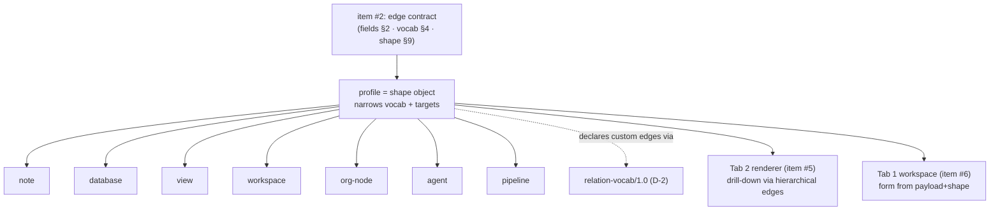
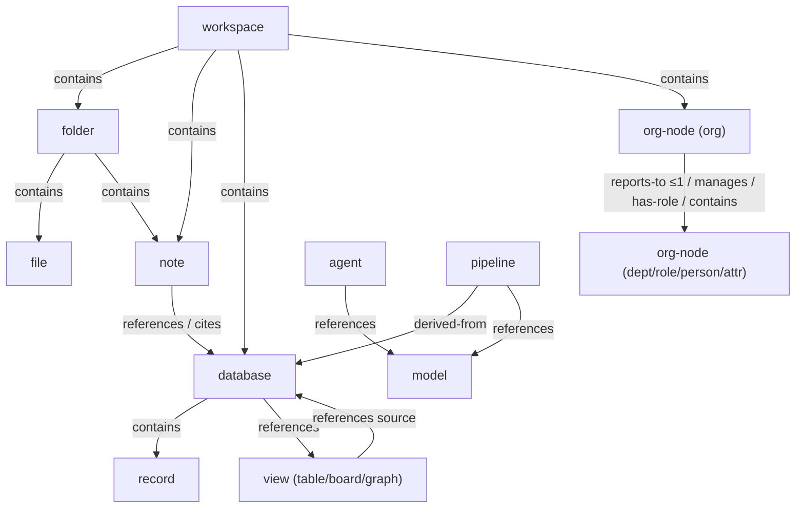

# 121XQ — Object Profiles (Published SCSO Profiles)

**Author:** Claude Code (design collaboration with Rashad Khan) · **Date:** 2026-08-20
**Status:** DESIGN / SPEC DRAFT — nothing here is built, wired, or deployed.
**Scope:** The published SCSO **profiles** for the objects that live in the 121XQ workspace and render as
nodes in Tab 2. Each profile **narrows** the shared edge vocabulary and `shape` contract fixed by item #2.
**Builds on:** `121XQ_RELATIONS_FACET_SPEC.md` (item **#2** — edge fields §2, core vocabulary §4, shape
pattern §9, renderer contract §10, house-style examples §11; the five locked decisions **D-1…D-5**),
`121XQ_AI_OS_SPEC_v5_SYNTHESIS.md` (Tab 2 nodes §3, object-profile table §8, principles §9, `note`
example §10), `121XML_v4_SEMANTIC_OBJECT_DESIGN.md` (SCSO facets, delegate-don't-reinvent),
`121XML_AI_OS_FINAL_SPECIFICATIONS.md` (axioms A1–A3, rules R4–R7).
**Position in build order:** item **#3** of v5 §12. Consumes item #2; feeds item **#5** (Tab 2 /
121ObjectMap renderer) and item **#6** (Tab 1 workspace projections).

> **Honesty note (per user directive).** This is a *specification draft*, not an implementation. No profile
> here is coded, validated, registered, or deployed. No renderer reads it yet. Status and hand-off are stated
> in §14. Nothing claims to be "production ready."

> **Locked decisions (2026-08-20, Rashad-approved).** The §14.2 questions are resolved and normative:
> **A-1** All inverses **derived by default**; materialization is opt-in and only for human-curated,
> low-churn edges (e.g. a confirmed `same-as`) — `manages`/`role-of` are **derived** from `reports-to`/`has-role`,
> not required materialized.
> **A-2** Model-registry has **one** canonical form: a **`database` whose records are `model` objects**
> (`model` `instance-of`→that database); a `pipeline` **`references`** the specific `model`. The pipeline
> `instance-of`→database modeling is dropped.
> **A-3** Secrets/keys/tokens **never** appear in signed, content-addressed payloads; objects hold secret
> *handles* (CIDs into the item-#4 encrypted vault). Confirmed boundary.
> **A-4** `profile` (R6 URI) is **authoritative**; `_type` is a **derived, non-authoritative** short-name
> (the profile's last path segment) kept for the A2 axiom tag and readability — it must never disagree with `profile`.

> **PHASE 1 QA FLAG (2026-08-28, per Round 1 decision B9) — unresolved, for Phase 2 design:**
> Rashad's Round 1 ruling states: *"a profile is an object, or a collection thereof."* This document
> currently models each profile as a single, published `shape` object per node type (§ below). Whether
> a profile can also be — or resolve to — a *collection* of objects is not yet reconciled with the
> single-object model here. This QA pass does not rewrite this spec's architecture — it flags the
> tension for the Phase 2 design pass. See `121XML_SPECIFICATION_DECISION_TABLE.md` §B9, and the
> parallel B8 flag in `121XQ_RELATIONS_FACET_SPEC.md` and `121XML_v4_SEMANTIC_OBJECT_DESIGN.md`.

> **Inherited locked decisions (2026-08-20, Rashad-approved) — normative here too:**
> **D-1** Canonical content address = **IPLD/multiformats CID**; `data://sha256:<HASH>:<TYPE>` is a
> human-readable **alias** only. All examples below use the alias form for readability and say so.
> **D-2** Namespaced custom edge types ship a companion **`urn:121xml:relation-vocab/1.0`** object — that
> profile is **defined in this document** (§4).
> **D-3** `provenance.prev` is the sole version chain; the `prev-version` graph edge is **derived, never stored**.
> **D-4** Ambiguous wikilinks **soft-resolve** (+`props.ambiguous`), never hard-fail.
> **D-5** An empty `relations` facet is **omitted (absent)**, never emitted empty.

---

## 1. Purpose & one-paragraph thesis

Item #2 fixed the **edge**. This document fixes the **nodes**. A *profile* is a published, content-addressed
`shape` object (R6 URI `urn:121xml:<name>/<version>`) that tells every 121XQ view three things about an
object type: (a) what `payload` fields it carries, (b) which **edge types from item #2 §4 it may assert and
what those edges may target**, and (c) which facets it uses and how. Because a profile is itself an SCSO
object addressed by CID, profiles are versioned and dedup'd like any other object (v4 §2). A profile never
invents edges; it *narrows* the base vocabulary — an `org-node` may not `contains`→`record`, a `database`
may not `reports-to` anything. The narrowing is the profile's whole job, and it is what lets Tab 2 draw a
correct, expandable graph and Tab 1 render a correct form. This document defines seven primary profiles
(`note`, `database`, `view`, `workspace`, `org-node`, `agent`, `pipeline`), the two supporting profiles the
contract now requires (`relation-vocab/1.0` promised by D-2, and the shared `_common` narrowing base), and
compact stubs for the remaining v5 §8 objects (`folder`, `file`, `record`, `model`, `dna-model`) so Tab 2
can render them.



---

## 2. Profile registry (the index every view reads first)

Node **category** is a coarse renderer grouping (item #2 §10 keeps icon/color out of the object; the
renderer owns the `category → style` table). **Key edges** lists only the profile-defining / drill-down
edges — the full allowed set is each profile's §-local table.

| Profile URI | Purpose (one line) | Node category | Key / drill-down edges (source→target) |
|---|---|---|---|
| `urn:121xml:workspace/1.0` | Vault root; the top of the containment tree. | `container` | `contains`→{folder,note,database,view,org-node,agent,pipeline,file} |
| `urn:121xml:folder/1.0` | Filesystem grouping node. | `container` | `contains`→{folder,file,note,database} |
| `urn:121xml:file/1.0` | Opaque byte blob (payload = bytes CID). | `leaf` | `contained-by`→{folder,workspace} (derived), `references`→any |
| `urn:121xml:note/1.0` | Markdown page/document. | `document` | `references`→any, `cites`→any, `contains`→note (sub-notes) |
| `urn:121xml:database/1.0` | Typed collection + its views. | `collection` | `contains`→record, `references`→view, `instance-of`→shape |
| `urn:121xml:view/1.0` | table/board/calendar/graph presentation spec. | `lens` | `references`→database (its source), `related-to`→view |
| `urn:121xml:record/1.0` | One database row / structured record. | `leaf` | `instance-of`→database, `references`→any, `owned-by`→org-node (derived) |
| `urn:121xml:org-node/1.0` | Org→Dept→Role→Person→Attribute node. | `org` | `reports-to`→org-node (≤1), `manages`→org-node, `has-role`→org-node, `contains`→org-node |
| `urn:121xml:agent/1.0` | Agentic object (goal, tools, guardrails, sub-agents). | `agent` | `contains`→agent (sub-agents), `references`→{model,pipeline,note}, `cites`→any |
| `urn:121xml:pipeline/1.0` | MLOps train/eval/deploy pipeline. | `process` | `references`→model, `derived-from`→{database,record}, `contains`→pipeline (stages) |
| `urn:121xml:model/1.0` | Registered model artifact + lineage. | `leaf` | `derived-from`→{database,pipeline}, `instance-of`→database (registry) |
| `urn:121xml:dna-model/1.0` | Sequence/biological object (any-object proof). | `leaf` | `references`→any, `derived-from`→dna-model |
| `urn:121xml:relation-vocab/1.0` | Declares a custom edge type's inverse/dir/cardinality/targets (D-2). | `meta` | *(none — it is metadata about edges, not a graph participant)* |
| `urn:121xml:_common/1.0` | Abstract narrowing base every profile inherits. | *(abstract)* | `related-to`→any, `same-as`→same-profile |

**Reading the tables.** Every profile below inherits the `_common` base (§3), then adds/removes edges.
Cardinality columns use `0..1`, `0..*`, `1..1`, `1..*`. "derived" means the inverse/backlink is computed by
the vault index (item #2 §7), never stored — do not author it.

---

## 3. How a profile narrows the base contract

A profile is a `shape` facet (item #2 §9) plus a `payload` field contract. Four narrowing levers, all
expressible in the JSON-Schema + SHACL pattern from item #2 §9:

1. **Edge-type allow-list.** Restrict `relations[].type` to an `enum` — the profile's Allowed-edges table.
   A type absent from the list is a validation error.
2. **Target-profile constraint.** For each allowed `type`, constrain the target's profile. Checked on
   resolution, or asserted eagerly via `props.to_type` (item #2 §6) so the renderer picks an icon without
   resolving. SHACL expresses this as `sh:class urn:121xml:type/<target>`.
3. **Cardinality.** `sh:maxCount` / `sh:minCount` per edge type (e.g. `reports-to` `maxCount 1`).
4. **Payload schema.** JSON Schema over the `payload` fields (present-only per R5).

### 3.1 The `_common/1.0` narrowing base

Every profile inherits this abstract base so the two universal edges never need re-stating:

| Edge `type` | Target profile(s) | Cardinality | Notes |
|---|---|---|---|
| `related-to` | any | `0..*` | Generic last-resort association (item #2 §4). Symmetric; `dir=undirected`. |
| `same-as` | **same profile** | `0..*` | Identity across vaults. Symmetric; materialization opt-in (item #2 §7). |

`_common` is **abstract**: no object declares `_type` = `_common`; profiles *extend* it. It also fixes the
cross-cutting rules that apply to every profile below, so they are stated once here:

- **Empty facet omitted (D-5).** If a profile instance has zero edges, it omits `relations` entirely.
- **No stored `prev-version` (D-3).** Version history is `provenance.prev`; the history edge is derived.
- **Custom edges need a vocab object (D-2).** Any `urn:121xml:rel:<ns>/<name>` a profile allows MUST resolve
  to a `relation-vocab/1.0` object (§4); absent that, the renderer draws it as an opaque directed edge.
- **Alias CIDs in examples (D-1).** Every `data://sha256:…:TYPE` below is a **human-readable alias**; the
  record form is an IPLD/multiformats CID.

---

## 4. Supporting profile — `relation-vocab/1.0` (fulfils D-2)

**URI:** `urn:121xml:relation-vocab/1.0`
**Purpose:** Declare, as a first-class content-addressed object, everything the validator and renderer need
to treat a **custom** (namespaced) edge type as first-class: its inverse, direction, cardinality, and the
profiles it may connect. Item #2 §4.1 promised this object; here it is.

A `relation-vocab` object is **metadata about an edge type**, not a graph participant — it does not itself
appear as a Tab 2 node (category `meta`), and it carries **no** `relations` facet of its own (so, per D-5,
`relations` is absent).

### 4.1 `payload` fields (normative)

| Field | Type | Req? (R5) | Meaning |
|---|---|---|---|
| `predicate` | `str` | **required** | The custom edge URI being declared, e.g. `urn:121xml:rel:myorg/approves`. Must be namespaced (never `…/rel:core/*`, which is reserved — item #2 §4.1). |
| `inverse` | `str` | **required** | The inverse predicate URI (may be another custom URI, or `self` for a symmetric predicate). |
| `dir` | `str` | optional (absent ⇒ `directed`) | `directed` or `undirected`. `undirected` implies `inverse` = `self`. |
| `label` | `str` | optional | Human display name (e.g. "approves"). Renderer fallback when no per-edge `label`. |
| `source_profiles` | `seq of str` | optional (absent ⇒ any) | Allowed source profile URIs. Homogeneous `str` sequence (A3). |
| `target_profiles` | `seq of str` | optional (absent ⇒ any) | Allowed target profile URIs. |
| `min_count` | `int` | optional (absent ⇒ 0) | Per-source cardinality floor. |
| `max_count` | `int` | optional (absent ⇒ unbounded) | Per-source cardinality ceiling. |
| `symmetric` | `bool` | optional (absent ⇒ false) | If `true`, `inverse`=`self` and backlinks appear from both ends. |
| `description` | `str` | optional | Prose for authors/reviewers. |

### 4.2 `shape` sketch (JSON Schema)

```json
{
  "$id": "urn:121xml:shape/relation-vocab/1.0",
  "type": "object",
  "additionalProperties": false,
  "required": ["predicate", "inverse"],
  "properties": {
    "predicate": { "type": "string", "pattern": "^urn:121xml:rel:(?!core/)[a-z0-9.-]+/[a-z0-9-]+(/[0-9.]+)?$" },
    "inverse":   { "type": "string", "minLength": 1 },
    "dir":       { "enum": ["directed", "undirected"] },
    "label":     { "type": "string" },
    "source_profiles": { "type": "array", "items": { "type": "string" } },
    "target_profiles": { "type": "array", "items": { "type": "string" } },
    "min_count": { "type": "integer", "minimum": 0 },
    "max_count": { "type": "integer", "minimum": 1 },
    "symmetric": { "type": "boolean" },
    "description": { "type": "string" }
  }
}
```

### 4.3 Worked example — declaring `myorg/approves`

```xml
<map profile="urn:121xml:relation-vocab/1.0" version="1.0">
  <str name="_type">relation-vocab</str>
  <str name="description">A person/role approves a record (e.g. an invoice).</str>
  <str name="inverse">urn:121xml:rel:myorg/approved-by</str>
  <str name="label">approves</str>
  <int name="max_count">1</int>
  <str name="predicate">urn:121xml:rel:myorg/approves</str>
  <seq name="source_profiles" of="str">
    <str>urn:121xml:org-node/1.0</str>
  </seq>
  <seq name="target_profiles" of="str">
    <str>urn:121xml:record/1.0</str>
  </seq>
  <map name="provenance"><str name="owner">did:key:z6Mk…</str><str name="sig">cose:…</str></map>
  <str name="_address">data://sha256:va1a…:relation-vocab</str>
</map>
```

*(Alias CID per D-1.)* No `relations` facet is present (this object asserts no edges — D-5). An object that
uses `urn:121xml:rel:myorg/approves` references this vocab object by CID in the edge's
`props.vocab` (recommended) so the validator/renderer can resolve inverse and constraints; absent a resolved
vocab object, item #2 §4.1 says the type renders as an opaque directed edge labelled `approves`.

**Judgment call (flag for red-line):** I put the vocab-object pointer in the *edge's* `props.vocab`, not in
the profile shape, so a single object can mix core and custom edges without pre-registering vocab at the
profile level. Alternative: profiles list their custom predicates' vocab CIDs in the `shape`. Rashad to pick.

---

## 5. Profile — `note/1.0`

**URI:** `urn:121xml:note/1.0` · **Purpose:** a Markdown page/document you own; the atomic unit of Tab 1.

### 5.1 `payload` fields

| Field | Type | Req? (R5) | Meaning |
|---|---|---|---|
| `title` | `str` | **required** | Display title; also the wikilink resolution key (item #2 §7.1). |
| `payload_md` | `str` | **required** | The Markdown body you own. Source of compiled `[[wikilinks]]`. |
| `tags` | `seq of str` | optional | Freeform labels; homogeneous (A3). |
| `icon` | `str` | optional | Author-chosen emoji/glyph hint (still a data field; renderer may honor). |
| `cover` | `str` | optional | CID of a cover image `file` object. |
| `props` | `map` | optional | Extra page properties (Notion-style), R4-sorted. |

### 5.2 `shape` constraints — edge allow-list

```json
{
  "$id": "urn:121xml:shape/note/1.0#relations-edge",
  "allOf": [ { "$ref": "urn:121xml:shape/relations-edge/1.0" } ],
  "properties": {
    "type": { "enum": ["references", "cites", "contains", "derived-from", "related-to", "same-as"] }
  }
}
```

### 5.3 Allowed edges

| Edge `type` | Target profile(s) | Cardinality | Notes |
|---|---|---|---|
| `references` | any | `0..*` | Compiled from `[[wikilinks]]` (item #2 §7.1). Backlink `referenced-by` derived. |
| `cites` | any | `0..*` | Assertion-grade citation (P12 auditable). Distinct from `references`: `cites` claims evidence. |
| `contains` | `note` | `0..*` | Optional sub-note nesting (outline/child pages). Drill-down edge. |
| `derived-from` | `note`, `record` | `0..*` | This note was generated/transformed from a source (e.g. AI summary). |
| *(+ `_common`: `related-to`→any, `same-as`→note)* | | | |

### 5.4 Facets used

`payload` (title + Markdown + props) · `shape` (this profile) · `relations` (compiled links) ·
`provenance` (owner, `prev` chain, signature) · `context` optional (JSON-LD term meanings for `props`) ·
`rules`/`space` unused.

### 5.5 Worked example — a note with resolved, aliased, and cited edges

```xml
<map profile="urn:121xml:note/1.0" version="1.0">
  <str name="_type">note</str>
  <str name="payload_md">## Onboarding\nSee [[Security Policy]] and [[Payroll DB|payroll]]. Basis: [[Q3 Audit]].</str>
  <seq name="tags" of="str"><str>hr</str><str>runbook</str></seq>
  <str name="title">Onboarding Runbook</str>
  <seq name="relations" of="edge">
    <map>
      <str name="to">data://sha256:9f2a…:note</str>
      <str name="type">references</str>
    </map>
    <map>
      <str name="label">payroll</str>
      <str name="to">data://sha256:c71b…:database</str>
      <str name="type">references</str>
    </map>
    <map>
      <str name="to">data://sha256:aa01…:record</str>
      <str name="type">cites</str>
    </map>
  </seq>
  <map name="provenance">
    <str name="owner">did:key:z6Mk…</str>
    <str name="prev">data://sha256:00aa…:note</str>
    <str name="sig">cose:…</str>
  </map>
  <str name="_address">data://sha256:5e5e…:note</str>
</map>
```

*(Alias CIDs per D-1; keys R4-sorted; present-only per R5.)* `referenced-by`/`cited-by` backlinks derived;
version history via `provenance.prev`, so no `prev-version` edge is stored (D-3).

### 5.6 Renderer hints

Node category `document`. Drill-down edge: `contains` (sub-notes). `references`/`cites` are lateral links
(no expand). The renderer expands a note by requesting its `relations` facet on click (item #2 §10).

---

## 6. Profile — `database/1.0`

**URI:** `urn:121xml:database/1.0` · **Purpose:** a typed collection of `record`s plus the `view`s that
present them; the Notion-database lens over the object graph.

### 6.1 `payload` fields

| Field | Type | Req? (R5) | Meaning |
|---|---|---|---|
| `title` | `str` | **required** | Database name. |
| `record_shape` | `str` | **required** | CID of the `shape` object every member `record` must validate against. |
| `default_view` | `str` | optional | CID of the `view` shown first. |
| `properties` | `seq of map` | optional | Column/property definitions (name, type, options); homogeneous `map` (A3). |
| `description` | `str` | optional | Prose. |

### 6.2 `shape` constraints (SHACL sketch)

```turtle
@prefix sh: <http://www.w3.org/ns/shacl#> .
@prefix x1: <urn:121xml:rel:core/> .

<urn:121xml:shape/database/1.0> a sh:NodeShape ;
  sh:targetClass <urn:121xml:type/database> ;
  sh:property [ sh:path x1:contains ;      sh:class <urn:121xml:type/record> ] ;
  sh:property [ sh:path x1:references ;     sh:class <urn:121xml:type/view> ] ;
  sh:property [ sh:path x1:instance-of ;    sh:class <urn:121xml:type/shape> ; sh:maxCount 1 ] ;
  # closed predicate set enforced by the JSON-Schema enum in impl
  sh:closed false .
```

### 6.3 Allowed edges

| Edge `type` | Target profile(s) | Cardinality | Notes |
|---|---|---|---|
| `contains` | `record` | `0..*` | The rows. Drill-down edge. `contained-by` on the record is derived. |
| `references` | `view` | `0..*` | Views that present this database. `default_view` is one of these. |
| `instance-of` | `shape` | `0..1` | Points at `record_shape` — the schema all rows obey. `has-instance` derived. |
| `derived-from` | `database` | `0..*` | This DB was materialized/filtered from another (e.g. a synced/linked DB). |
| *(+ `_common`)* | | | |

### 6.4 Facets used

`payload` (title, schema ref, view refs, properties) · `shape` (this profile + the referenced `record_shape`)
· `relations` (rows + views) · `context` (property semantics) · `provenance`. `rules`/`space` unused.

### 6.5 Worked example — a database with a view and records

```xml
<map profile="urn:121xml:database/1.0" version="1.0">
  <str name="_type">database</str>
  <str name="default_view">data://sha256:v100…:view</str>
  <str name="record_shape">data://sha256:sh01…:shape</str>
  <str name="title">Vendors</str>
  <seq name="relations" of="edge">
    <map>
      <str name="to">data://sha256:sh01…:shape</str>
      <str name="type">instance-of</str>
    </map>
    <map>
      <str name="to">data://sha256:v100…:view</str>
      <str name="type">references</str>
    </map>
    <map>
      <int name="order">1</int>
      <str name="to">data://sha256:r001…:record</str>
      <str name="type">contains</str>
    </map>
    <map>
      <int name="order">2</int>
      <str name="to">data://sha256:r002…:record</str>
      <str name="type">contains</str>
    </map>
  </seq>
  <map name="provenance"><str name="owner">did:key:z6Mk…</str><str name="sig">cose:…</str></map>
  <str name="_address">data://sha256:db01…:database</str>
</map>
```

*(Alias CIDs per D-1.)* Each member `record` carries the inverse `instance-of`→database (see §11.3);
`contained-by`/`has-instance` backlinks are derived (item #2 §7).

### 6.6 Renderer hints

Node category `collection`. Drill-down edge: `contains`→`record`. The renderer offers each referenced `view`
as an alternate presentation of the same contained set (see §7). A database expands into its rows on click.

---

## 7. Profile — `view/1.0`

**URI:** `urn:121xml:view/1.0` · **Purpose:** a saved presentation spec over a database (or, for
`kind=graph`, over the relations graph itself). A view **owns no data** — it is a lens (P11).

### 7.1 `payload` fields

| Field | Type | Req? (R5) | Meaning |
|---|---|---|---|
| `title` | `str` | **required** | View name. |
| `kind` | `str` | **required** | Enum: `table` \| `board` \| `calendar` \| `list` \| `graph`. |
| `source` | `str` | **required** | CID of the `database` (or `workspace`, for a graph view) it presents. |
| `query` | `map` | optional | Filter/predicate spec (property comparisons, tag/time filters). |
| `sort` | `seq of map` | optional | Ordered sort keys `{field, dir}`; homogeneous `map` (A3). |
| `group_by` | `str` | optional | Property to group by (board columns / calendar bucket). |
| `graph_seed` | `str` | optional | For `kind=graph`: root CID the saved graph query expands from. |
| `edge_filter` | `seq of str` | optional | For `kind=graph`: edge types to include (subset of item #2 §4). |

### 7.2 `shape` constraints — edge allow-list

```json
{
  "$id": "urn:121xml:shape/view/1.0#relations-edge",
  "allOf": [ { "$ref": "urn:121xml:shape/relations-edge/1.0" } ],
  "properties": {
    "type": { "enum": ["references", "related-to", "same-as"] }
  }
}
```

### 7.3 Allowed edges

| Edge `type` | Target profile(s) | Cardinality | Notes |
|---|---|---|---|
| `references` | `database`, `workspace` | `1..1` | The `source` it presents. Exactly one. Backlink derived. |
| `related-to` | `view` | `0..*` | Sibling/linked views (e.g. a table and a board over one DB). |
| *(+ `_common`: `same-as`→view)* | | | |

### 7.4 Facets used

`payload` (kind, source ref, query/filter/sort/group) · `shape` (this profile) · `relations` (its single
source ref) · `provenance`. `context`/`rules`/`space` unused. Note the query lives in `payload`, per v5 §8.

### 7.5 Worked example — a `graph` view (a saved query over the relations graph)

```xml
<map profile="urn:121xml:view/1.0" version="1.0">
  <seq name="edge_filter" of="str"><str>contains</str><str>reports-to</str></seq>
  <str name="graph_seed">data://sha256:ws01…:workspace</str>
  <str name="kind">graph</str>
  <str name="source">data://sha256:ws01…:workspace</str>
  <str name="title">Org Chart (live)</str>
  <str name="_type">view</str>
  <seq name="relations" of="edge">
    <map>
      <str name="to">data://sha256:ws01…:workspace</str>
      <str name="type">references</str>
    </map>
  </seq>
  <map name="provenance"><str name="owner">did:key:z6Mk…</str><str name="sig">cose:…</str></map>
  <str name="_address">data://sha256:v200…:view</str>
</map>
```

*(Alias CIDs per D-1.)* A `graph` view is **literally a saved query over the `relations` graph**: it names a
`graph_seed` and an `edge_filter`, and the renderer materializes the subgraph by walking those edge types
from the seed. This is why "graph" is a `view.kind` alongside table/board/calendar, not a separate object.

### 7.6 Renderer hints

Node category `lens`. Not a drill-down container itself — it *is* a rendering instruction. For a `table`/
`board`/`calendar` view the renderer resolves `source`→database and lays out its `contains` records per
`query`/`sort`/`group_by`; for a `graph` view it walks `graph_seed` + `edge_filter` (a projection, P11).

---

## 8. Profile — `workspace/1.0`

**URI:** `urn:121xml:workspace/1.0` · **Purpose:** the vault root; the top of the containment tree and the
Tab 1 home. Everything else hangs off it via `contains`.

### 8.1 `payload` fields

| Field | Type | Req? (R5) | Meaning |
|---|---|---|---|
| `title` | `str` | **required** | Workspace/vault name. |
| `home` | `str` | optional | CID of the landing `note` or `view`. |
| `description` | `str` | optional | Prose. |
| `settings` | `map` | optional | Vault-level settings (default engine, locale); R4-sorted. Non-secret only. |

### 8.2 `shape` constraints (SHACL sketch)

```turtle
<urn:121xml:shape/workspace/1.0> a sh:NodeShape ;
  sh:targetClass <urn:121xml:type/workspace> ;
  sh:property [ sh:path x1:contains ] ;   # container children — target profiles below
  sh:closed false .
```

### 8.3 Allowed edges

| Edge `type` | Target profile(s) | Cardinality | Notes |
|---|---|---|---|
| `contains` | `folder`, `note`, `database`, `view`, `org-node`, `agent`, `pipeline`, `file` | `0..*` | Top-level children. **The** drill-down edge. `contained-by` derived on each child. |
| `references` | `view` | `0..*` | Pinned/home views. |
| *(+ `_common`)* | | | |

### 8.4 Facets used

`payload` (title/home/settings) · `relations` (contains tree) · `provenance` (owner keys — this is where
vault ownership is anchored, v5 §4). `shape` (this profile). `context`/`rules`/`space` unused.

### 8.5 Worked example — a workspace containing notes and a database

```xml
<map profile="urn:121xml:workspace/1.0" version="1.0">
  <str name="home">data://sha256:5e5e…:note</str>
  <str name="title">Acme HQ Vault</str>
  <str name="_type">workspace</str>
  <seq name="relations" of="edge">
    <map>
      <int name="order">1</int>
      <str name="to">data://sha256:fold…:folder</str>
      <str name="type">contains</str>
    </map>
    <map>
      <int name="order">2</int>
      <str name="to">data://sha256:5e5e…:note</str>
      <str name="type">contains</str>
    </map>
    <map>
      <int name="order">3</int>
      <str name="to">data://sha256:db01…:database</str>
      <str name="type">contains</str>
    </map>
    <map>
      <int name="order">4</int>
      <str name="to">data://sha256:org0…:org-node</str>
      <str name="type">contains</str>
    </map>
  </seq>
  <map name="provenance"><str name="owner">did:key:z6Mk…</str><str name="sig">cose:…</str></map>
  <str name="_address">data://sha256:ws01…:workspace</str>
</map>
```

*(Alias CIDs per D-1.)* This is the root the `graph` view of §7.5 seeds from. Drill-down: Workspace→folder→
file (§10) and Workspace→org-node→…→attribute (§9) are both just `contains`/hierarchical-edge walks.

### 8.6 Renderer hints

Node category `container` (root). Drill-down edge: `contains`. Tab 2 opens the graph at the workspace root
and expands children on demand; Tab 1 renders the same `contains` tree as its sidebar.

---

## 9. Profile — `org-node/1.0`

**URI:** `urn:121xml:org-node/1.0` · **Purpose:** one node in the Org→Dept→Role→Person→Attribute hierarchy
(v5 §3 drill-down). A single profile covers all five levels; the level is a `payload.kind`.

### 9.1 `payload` fields

| Field | Type | Req? (R5) | Meaning |
|---|---|---|---|
| `title` | `str` | **required** | Display name (person name, role title, dept name…). |
| `kind` | `str` | **required** | Enum: `org` \| `dept` \| `role` \| `person` \| `attribute`. |
| `attributes` | `map` | optional | Person/role attributes (email, fte, location); R4-sorted, non-secret. |
| `description` | `str` | optional | Prose. |

### 9.2 `shape` constraints (SHACL sketch — the canonical narrowing example)

```turtle
<urn:121xml:shape/org-node/1.0> a sh:NodeShape ;
  sh:targetClass <urn:121xml:type/org-node> ;
  # at most one manager, which must itself be an org-node
  sh:property [ sh:path x1:reports-to ; sh:maxCount 1 ; sh:class <urn:121xml:type/org-node> ] ;
  sh:property [ sh:path x1:manages    ; sh:class <urn:121xml:type/org-node> ] ;
  sh:property [ sh:path x1:has-role   ; sh:class <urn:121xml:type/org-node> ] ;
  sh:property [ sh:path x1:role-of    ; sh:class <urn:121xml:type/org-node> ] ;
  sh:property [ sh:path x1:contains   ; sh:class <urn:121xml:type/org-node> ] ;
  sh:property [ sh:path x1:owns       ; sh:class <urn:121xml:type/record> ] ;
  sh:closed false .   # predicate allow-list enforced by JSON-Schema enum in impl
```

### 9.3 Allowed edges

| Edge `type` | Target profile(s) | Cardinality | Notes |
|---|---|---|---|
| `reports-to` | `org-node` | `0..1` | Org hierarchy. **`maxCount 1`.** `manages` inverse derived. Drill-down (up). |
| `manages` | `org-node` | `0..*` | Usually derived from subordinates' `reports-to`; may be materialized for a curated chart. Drill-down (down). |
| `has-role` | `org-node` (`kind=role`) | `0..*` | Person→Role. `role-of` inverse derived. Drill-down. |
| `role-of` | `org-node` (`kind=person`) | `0..*` | Materialized only when curated; else derived. |
| `contains` | `org-node` | `0..*` | Dept→sub-dept, role→attribute nesting. Drill-down. |
| `owns` | `record`, `note` | `0..*` | Governance ownership (item #2 §4). `owned-by` derived. |
| *(+ `_common`)* | | | |

### 9.4 Facets used

`payload` (name, kind, attributes) · `shape` (this profile) · `relations` (org edges) · `provenance`.
`context` optional (map attribute keys to a HR ontology). `rules`/`space` unused.

### 9.5 Worked example — a person with a reports-to / has-role chain

```xml
<map profile="urn:121xml:org-node/1.0" version="1.0">
  <map name="attributes"><str name="email">jane@acme.example</str><num name="fte">1.0</num></map>
  <str name="kind">person</str>
  <str name="title">Jane Doe</str>
  <str name="_type">org-node</str>
  <seq name="relations" of="edge">
    <map>
      <str name="label">Chief Financial Officer</str>
      <map name="props"><str name="role_title">CFO</str></map>
      <str name="to">data://sha256:9b9b…:org-node</str>
      <str name="type">has-role</str>
      <map name="valid_time"><str name="start">2024-02-01</str></map>
    </map>
    <map>
      <map name="props"><str name="since">2024-02-01</str></map>
      <str name="to">data://sha256:7a7a…:org-node</str>
      <str name="type">reports-to</str>
    </map>
  </seq>
  <map name="provenance"><str name="owner">did:key:z6Mk…</str><str name="sig">cose:…</str></map>
  <str name="_address">data://sha256:org0…:org-node</str>
</map>
```

*(Alias CIDs per D-1; the target `9b9b…` is a `kind=role` org-node, `7a7a…` the manager.)* `manages` /
`role-of` backlinks are derived. Open-ended `valid_time` (no `end`, absent not null) = "still in role."

### 9.6 Renderer hints

Node category `org`. Drill-down edges: `reports-to`/`manages`/`has-role`/`contains` — these drive the
Org→Dept→Role→Person→Attribute expand tree (v5 §3). Because `reports-to` is `maxCount 1`, the renderer can
draw a clean tree upward and fan `manages` downward.

---

## 10. Profile — `agent/1.0`

**URI:** `urn:121xml:agent/1.0` · **Purpose:** an agentic object: goal, tools, guardrails, and optional
sub-agents (v5 §6). Tool calls and runs are logged as separate content-addressed objects for auditability
(P12); this object is the *definition*, not the run log.

### 10.1 `payload` fields

| Field | Type | Req? (R5) | Meaning |
|---|---|---|---|
| `title` | `str` | **required** | Agent name. |
| `goal` | `str` | **required** | Natural-language objective. |
| `tools` | `seq of str` | optional | Tool identifiers the agent may call; homogeneous (A3). |
| `guardrails` | `seq of str` | optional | Policy/constraint statements (also see `rules` facet). |
| `engine` | `str` | optional | Preferred engine hint (Claude/Codex/local); adapter routes (v5 §6). |
| `params` | `map` | optional | Model params (temperature, max-tokens); R4-sorted. |

### 10.2 `shape` constraints — edge allow-list

```json
{
  "$id": "urn:121xml:shape/agent/1.0#relations-edge",
  "allOf": [ { "$ref": "urn:121xml:shape/relations-edge/1.0" } ],
  "properties": {
    "type": { "enum": ["contains", "references", "cites", "derived-from", "related-to", "same-as"] }
  }
}
```

### 10.3 Allowed edges

| Edge `type` | Target profile(s) | Cardinality | Notes |
|---|---|---|---|
| `contains` | `agent` | `0..*` | Sub-agents. Drill-down edge. `contained-by` derived. |
| `references` | `model`, `pipeline`, `note`, `database` | `0..*` | Resources the agent uses (a model it calls, a KB it reads). |
| `cites` | any | `0..*` | Evidence CIDs an agent answer used (P12 auditable AI). |
| `derived-from` | `agent` | `0..*` | Cloned/specialized from a template agent. |
| *(+ `_common`)* | | | |

### 10.4 Facets used

`payload` (goal/tools/engine/params) · `rules` (guardrails as executable constraints — the one profile that
leans on the `rules` facet) · `shape` (this profile) · `relations` (sub-agents + resources) · `provenance`.
`context`/`space` unused.

### 10.5 Worked example — an agent with sub-agents and a model reference

```xml
<map profile="urn:121xml:agent/1.0" version="1.0">
  <str name="engine">claude</str>
  <str name="goal">Answer HR policy questions from the vault, always citing source CIDs.</str>
  <seq name="guardrails" of="str"><str>never expose PII</str><str>cite every claim</str></seq>
  <str name="title">HR Wiki Agent</str>
  <seq name="tools" of="str"><str>vault.search</str><str>vault.read</str></seq>
  <str name="_type">agent</str>
  <seq name="relations" of="edge">
    <map>
      <str name="to">data://sha256:sub1…:agent</str>
      <str name="type">contains</str>
    </map>
    <map>
      <str name="to">data://sha256:mdl1…:model</str>
      <str name="type">references</str>
    </map>
    <map>
      <str name="to">data://sha256:db01…:database</str>
      <str name="type">references</str>
    </map>
  </seq>
  <map name="provenance"><str name="owner">did:key:z6Mk…</str><str name="sig">cose:…</str></map>
  <str name="_address">data://sha256:agt1…:agent</str>
</map>
```

*(Alias CIDs per D-1.)* The agent's *runs* (tool calls, results, `cites` edges to evidence) are logged as
separate objects so this definition object stays stable while run history accretes elsewhere.

### 10.6 Renderer hints

Node category `agent`. Drill-down edge: `contains` (sub-agent tree). `references`→model/pipeline are lateral
resource links Tab 4 (Engines & Agents) surfaces; Tab 2 shows the same edges as graph links.

---

## 11. Profile — `pipeline/1.0`

**URI:** `urn:121xml:pipeline/1.0` · **Purpose:** an MLOps pipeline describing train / eval / deploy stages,
referencing a model registry (v5 §6). Abacus-grade, engine-agnostic.

### 11.1 `payload` fields

| Field | Type | Req? (R5) | Meaning |
|---|---|---|---|
| `title` | `str` | **required** | Pipeline name. |
| `stages` | `seq of map` | **required** | Ordered stage specs `{name, kind, config}` where `kind ∈ {train, eval, deploy}`; homogeneous (A3). |
| `model_registry` | `str` | optional | CID of the `database` acting as the model registry. |
| `schedule` | `str` | optional | Cron/trigger spec. |
| `params` | `map` | optional | Global hyperparameters; R4-sorted. |

### 11.2 `shape` constraints (SHACL sketch)

```turtle
<urn:121xml:shape/pipeline/1.0> a sh:NodeShape ;
  sh:targetClass <urn:121xml:type/pipeline> ;
  sh:property [ sh:path x1:references   ; sh:class <urn:121xml:type/model> ] ;
  sh:property [ sh:path x1:derived-from ] ;   # training data: database or record
  sh:property [ sh:path x1:contains     ; sh:class <urn:121xml:type/pipeline> ] ;  # sub-pipelines/stages
  sh:closed false .
```

### 11.3 Allowed edges

| Edge `type` | Target profile(s) | Cardinality | Notes |
|---|---|---|---|
| `references` | `model` | `0..*` | Models produced/consumed; `model_registry` DB is referenced via `instance-of` below or a `references`→database. |
| `derived-from` | `database`, `record` | `0..*` | Training/eval datasets. `derives` inverse derived. |
| `contains` | `pipeline` | `0..*` | Sub-pipelines / stage decomposition. Drill-down. |
| `instance-of` | `database` | `0..1` | The model-registry database this pipeline writes to. |
| *(+ `_common`)* | | | |

### 11.4 Facets used

`payload` (stages, registry ref, schedule, params) · `shape` (this profile) · `relations` (models + datasets)
· `provenance` (run lineage — model provenance chains live here, v5 §6). `rules` optional (gating policy).
`context`/`space` unused.

### 11.5 Worked example — a pipeline referencing a model and its dataset

```xml
<map profile="urn:121xml:pipeline/1.0" version="1.0">
  <str name="model_registry">data://sha256:reg1…:database</str>
  <seq name="stages" of="map">
    <map><map name="config"><str name="epochs">3</str></map><str name="kind">train</str><str name="name">fit</str></map>
    <map><map name="config"><str name="metric">f1</str></map><str name="kind">eval</str><str name="name">score</str></map>
    <map><map name="config"><str name="target">prod</str></map><str name="kind">deploy</str><str name="name">ship</str></map>
  </seq>
  <str name="title">Vendor-Risk Classifier</str>
  <str name="_type">pipeline</str>
  <seq name="relations" of="edge">
    <map>
      <str name="to">data://sha256:db01…:database</str>
      <str name="type">derived-from</str>
    </map>
    <map>
      <str name="to">data://sha256:mdl1…:model</str>
      <str name="type">references</str>
    </map>
    <map>
      <str name="to">data://sha256:reg1…:database</str>
      <str name="type">instance-of</str>
    </map>
  </seq>
  <map name="provenance"><str name="owner">did:key:z6Mk…</str><str name="sig">cose:…</str></map>
  <str name="_address">data://sha256:pipe…:pipeline</str>
</map>
```

*(Alias CIDs per D-1.)* The referenced `model` (`mdl1…`) carries its own `derived-from`→pipeline/dataset
lineage (§12 stub); `derives` and `has-instance` backlinks are derived.

### 11.6 Renderer hints

Node category `process`. Drill-down edge: `contains` (stage/sub-pipeline tree). `derived-from`→dataset and
`references`→model draw the MLOps lineage graph Tab 4 (and Tab 2) render identically.

---

## 12. Compact profile stubs (v5 §8 objects Tab 2 must render)

These appear as Tab 2 nodes but do not need full treatment for item #3. Each stub gives URI, purpose,
minimal `payload`, key allowed edges, and category. All inherit `_common` (§3.1) and obey D-1…D-5.

### 12.1 `folder/1.0`
**Purpose:** filesystem grouping. **Category:** `container`. **payload:** `title` (req), `description` (opt).
**Key edges:** `contains`→{`folder`,`file`,`note`,`database`} `0..*` (drill-down; ordered via `order`);
`contained-by` derived. *House-style example is item #2 §11.1.*

### 12.2 `file/1.0`
**Purpose:** opaque byte blob. **Category:** `leaf`. **payload:** `title` (req), `bytes` = CID of the raw
content (req), `mime` (opt), `size` (opt `int`). **Key edges:** `references`→any `0..*`; `contained-by`→
{`folder`,`workspace`} derived. Payload bytes are content-addressed separately so large blobs dedup (v4 §2).

### 12.3 `record/1.0`
**Purpose:** one database row. **Category:** `leaf`. **payload:** validated by its database's `record_shape`
(fields are data-defined, not fixed here); `title` (opt, for display). **Key edges:** `instance-of`→
`database` `1..1` (the DB it belongs to; `has-instance`/`contained-by` derived); `references`→any `0..*`;
`owned-by`→`org-node` (derived from the org-node's `owns`). **Example:**

```xml
<map profile="urn:121xml:record/1.0" version="1.0">
  <str name="title">Acme Supplies Ltd</str>
  <str name="_type">record</str>
  <seq name="relations" of="edge">
    <map>
      <str name="to">data://sha256:db01…:database</str>
      <str name="type">instance-of</str>
    </map>
  </seq>
  <map name="provenance"><str name="owner">did:key:z6Mk…</str><str name="sig">cose:…</str></map>
  <str name="_address">data://sha256:r001…:record</str>
</map>
```
*(Alias CIDs per D-1.)* Its `contained-by`→database backlink is derived, so the database's `contains` edge
(§6.5) and this `instance-of` edge together fix membership without dual authority.

### 12.4 `model/1.0`
**Purpose:** a registered model artifact + lineage. **Category:** `leaf`. **payload:** `title` (req),
`artifact` = CID/URI of weights (opt), `metrics` (opt `map`), `version_tag` (opt). **Key edges:**
`derived-from`→{`database`,`pipeline`} `0..*` (training lineage); `instance-of`→`database` `0..1` (the
registry). `derives`/`has-instance` derived.

### 12.5 `dna-model/1.0`
**Purpose:** a sequence/biological object — the "any object modellable in 121XML" proof (v5 §8). **Category:**
`leaf`. **payload:** `title` (req), `sequence` (req `str`), `alphabet` (opt, e.g. `dna`/`rna`/`protein`),
`annotations` (opt `seq of map`). **Key edges:** `references`→any `0..*`; `derived-from`→`dna-model` `0..*`
(e.g. a mutated variant). Tab 2 renders it identically to any other node — that is the point (v5 §8).

---

## 13. How profiles compose (the workspace as one graph)

The profiles interlock into a single containment-plus-reference graph. Composition is expressed **only**
through `relations` edges — there is no separate schema of "which contains which" beyond each profile's
Allowed-edges table.



Three composition facts worth stating plainly:

1. **A `workspace` contains `folder`/`note`/`database`/… ; a `folder` recursively contains the same file-ish
   set.** Containment is one edge type (`contains`) walked by the renderer; the drill-down tree is just its
   transitive closure (item #2 §10).
2. **A `database` contains `record`s and is *presented by* `view`s.** Containment (`database`—`contains`→
   `record`) is data ownership; presentation (`view`—`references`→`database`) is a lens (P11). A record can
   be shown by many views without moving.
3. **A `view` of kind `graph` is literally a saved query over the relations graph** (§7.5): a seed CID plus
   an edge-type filter. It composes with *any* node, which is why the graph lens is universal rather than
   database-specific.

---

## 14. Design decisions, judgment calls, and hand-off

### 14.1 Judgment calls made here (flagged for Rashad's red-line)

1. **`_common/1.0` abstract base (new).** I factored `related-to` + `same-as` into an abstract narrowing base
   every profile inherits, rather than repeating them in twelve tables. *Alternative:* no base, restate per
   profile. Chosen for DRY and because item #2 treats both as universal symmetric edges. **Red-line: keep or
   inline?**
2. **Custom-edge vocab pointer lives in the edge's `props.vocab`** (§4.3), not in the profile `shape`. Lets one
   object mix core + custom edges without profile-level pre-registration. *Alternative:* profiles enumerate
   their custom predicates' vocab CIDs. **Red-line needed.**
3. **`org-node` is one profile for all five levels** (org/dept/role/person/attribute) discriminated by
   `payload.kind`, per v5 §3 which lists them as one drill-down chain. *Alternative:* five profiles. Chosen so
   the reports-to/has-role/contains edges have one target class (`org-node`) and the SHACL stays simple.
4. **`view.kind=graph` modeled as a saved query in `payload`** (seed + edge_filter) rather than a stored
   materialized subgraph. Keeps the view a pure lens (P11); the subgraph is recomputed, never dual-stored.
5. **`record` payload is shape-defined, not fixed by this profile.** The `database.record_shape` CID is the
   authority; `record/1.0` only fixes the edges. This keeps arbitrary user schemas out of this spec.
6. **`agent` is the only profile leaning on the `rules` facet** (guardrails), and `pipeline`/`model` put
   lineage in `provenance`. I did **not** invent new facets — everything maps to the v4 seven.
7. **Cardinality only tightly constrained where semantics demand it** (`reports-to` `0..1`, `view.references
   source` `1..1`, `record.instance-of` `1..1`). Elsewhere `0..*`, to avoid over-fitting a draft.

### 14.2 Resolved decisions (2026-08-20, Rashad-approved) — normative

- **A-1 (inverses):** all inverses **derived by default**; opt-in materialization only for human-curated,
  low-churn edges. `manages`/`role-of` are **derived** from `reports-to`/`has-role` — not required materialized.
- **A-2 (model-registry):** **one** canonical form — a **`database` whose records are `model` objects**
  (`model` `instance-of`→that database); a `pipeline` **`references`** the specific `model`. The alternative
  (pipeline `instance-of`→database) is dropped; edit any example accordingly.
- **A-3 (secrets):** secrets/keys/tokens **never** in signed, content-addressed payloads; objects carry secret
  *handles* (CIDs into the item-#4 encrypted vault). Boundary confirmed.
- **A-4 (`_type` vs `profile`):** `profile` (R6 URI) is **authoritative**; `_type` is a **derived,
  non-authoritative** short-name (profile's last path segment), kept for the A2 tag and readability, and must
  never disagree with `profile`.

### 14.3 Honest status

This is a **spec draft** — the node contract on paper. No profile here is coded, registered as a `shape`
object, validated against, or rendered. The JSON-Schema/SHACL blocks are **sketches** (the SHACL uses
`sh:closed false` with a note that the predicate allow-list is enforced by the JSON-Schema `enum` in the
eventual implementation — neither validator exists yet). Nothing is built, wired, or deployed.

### 14.4 Hand-off (build order, v5 §12)

- **Feeds item #5 — Tab 2 / 121ObjectMap renderer.** §2's node categories and each profile's drill-down
  edges tell the renderer how to expand each node type; the `category → icon/color` table stays in the
  renderer (item #2 §10), so styling never touches an object CID.
- **Feeds item #6 — Tab 1 workspace.** Each profile's `payload` field table is the form spec (Tab 1 renders
  a note/database/record editor from `payload` + `shape`); the `workspace.contains` tree is the sidebar.
- **Consumes item #2.** Every edge type, field, and validation pattern here is narrowed from the item #2
  contract — this document invents no edges and no facets.
- **Depends on item #4 (vault) for secrets** (Q-C): payloads here are non-secret by construction.

---

*Spec draft for red-line. Grounded in item #2's edge contract and v4 SCSO (delegate-don't-reinvent); obeys
A1–A3 and R4 (sorted keys), R5 (null-vs-absent), R6 (profile URIs), R7 (content addressing); honors D-1…D-5.
A profile is a content-addressed `shape` object that narrows the shared edge vocabulary for one node type —
nothing new is invented at the node layer. Nothing here is built, validated, or deployed.*
