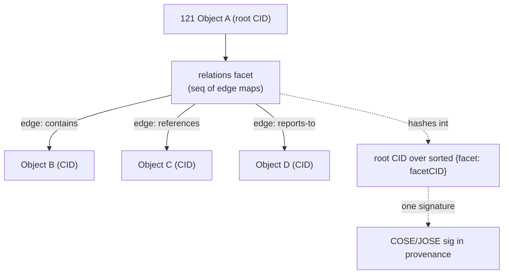
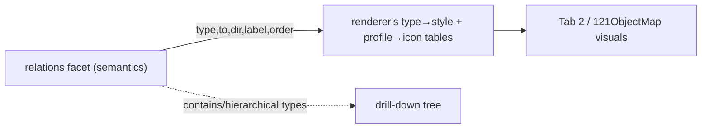

# 121XQ — The `relations` Facet Schema (Edge Contract)

**Author:** Claude Code (design collaboration with Rashad Khan) · **Date:** 2026-08-20
**Status:** DESIGN / SPEC DRAFT — nothing here is built or deployed.
**Scope:** Formal schema for the `relations` facet of the Self-Contained Semantic Object (SCSO).
**Builds on:** `121XML_v4_SEMANTIC_OBJECT_DESIGN.md` (SCSO facets, delegate-don't-reinvent),
`121XQ_AI_OS_SPEC_v5_SYNTHESIS.md` (Tab 2 graph editor §3, profiles §8, principles §9, note example §10),
`121XML_AI_OS_FINAL_SPECIFICATIONS.md` (axioms A1–A3, rules R4–R7).
**Position in build order:** item **#2** of v5 §12 — the single dependency for **#3** (object profiles)
and **#5** (Tab 2 / 121ObjectMap renderer). This document is that contract.

> **Honesty note (per user directive):** this is a *specification*, not an implementation. No part of
> this facet is coded, wired, or deployed. Status and hand-off are stated explicitly in §13.

> **Locked decisions (2026-08-20, Rashad-approved).** The five open questions from the first draft are now
> resolved and normative; the body reflects them and §13 records them:
> **D-1** Canonical target/CID form = **IPLD/multiformats**; `data://sha256:<HASH>:<TYPE>` is a
> human-readable **debug/legacy alias** only.
> **D-2** Namespaced custom edge types **ship a companion `urn:121xml:relation-vocab/1.0` object** (inverse + constraints).
> **D-3** `provenance.prev` is the **sole chain of record**; the `prev-version` graph edge is **derived, never stored**.
> **D-4** Ambiguous wikilinks **soft-resolve** (smallest-CID) **+ `props.ambiguous` flag + UI nudge** — never hard-fail.
> **D-5** An empty `relations` facet is **omitted (absent)** — normative, not optional.

---

> **PHASE 1 QA FLAG (2026-08-28, per Round 1 decision B8) — unresolved, for Phase 2 design:**
> Rashad's Round 1 ruling states: *"relations are just another object in 121xml, not a
> privileged/special facet type."* This nuances the entire premise of this document, which specs
> `relations` as a distinct, privileged SCSO facet (per `121XML_v4_SEMANTIC_OBJECT_DESIGN.md` §2).
> This QA pass does not rewrite this spec's architecture — it flags the tension for the Phase 2 design
> pass to resolve. See `121XML_SPECIFICATION_DECISION_TABLE.md` §B8.

## 1. Purpose & one-paragraph thesis

The `relations` facet is the **graph**. It is the ordered set of **typed, directed edges** that leave a
single 121XML object and point (by content address) at other 121XML objects. Because the edges live
*inside* the object — not in a bolted-on graph database — the object graph is a native property of the
store (v5 principle **P9, knowledge-graph-native**), and every view (Tab 2 render, backlinks, wiki
navigation) is a projection of it (**P11, one store, many views**). This document fixes the edge fields,
a controlled base vocabulary, the wikilink-compilation rule, canonicalization/hashing (R4/R7), the
inverse/backlink model, the `shape`-facet validation contract, the honest delegation mapping, the
minimal renderer contract, and worked canonical-121XML examples.



The `from` end of every edge is **implicit**: it is the object that carries the facet. An edge never
stores its own source; storing it would duplicate state that the root CID already fixes, and would break
determinism if the two disagreed.

---

## 2. Edge object model (the fields of one edge)

An edge is a 121XML `<map>` (an RDF-triple-shaped record; see §8 delegation). The following table is the
**normative field list**. "Req?" follows **R5**: *required* = must be present; *optional* = **absent when
not used** (do **not** emit an explicit `null` placeholder — absence and `null` are semantically distinct
and `null` is reserved for "known-empty", which no edge field currently defines).

| Field | Req? | 121XML type | Meaning | Constraints |
|---|---|---|---|---|
| `type` | **required** | `str` | The predicate — controlled token (§4) **or** a namespaced URI (`urn:121xml:rel:<ns>/<name>`). | Non-empty. Controlled tokens are lowercase-kebab. |
| `to` | **required** | `str` | Target object's content address (the IPLD/CID link). | **Canonical = IPLD/multiformats CID** (D-1); `data://sha256:<HASH>:<TYPE>` accepted as debug/legacy alias; §6. |
| `label` | optional | `str` | Human display text for the edge (e.g. a wikilink alias). | Presentation semantics only; never affects the hash's meaning but **is** hashed as data. |
| `dir` | optional | `str` | `directed` (default when absent) or `undirected`. | Enum. Absent ⇒ `directed`. |
| `props` | optional | `map` | Property-graph attributes (arbitrary sorted key/values). | Keys R4-sorted; values are canonical 121XML scalars/containers. |
| `order` | optional | `int` | Stable sort key for *ordered children* (e.g. folder listing, ordered steps). | Integer; ties broken by canonical edge order (§5). |
| `valid_time` | optional | `map` | Temporal validity of the edge; aligns to the `space`/`provenance` time model. | `{start, end}` ISO-8601 instants or interval; open interval omits the unused bound (absent, not null). |
| `weight` | optional | `num` | Numeric edge weight (ranking, confidence, similarity). | Renderer treats as data only (§11 keeps styling out). |

Notes:
- **Minimum viable edge** is `{type, to}`. Everything else is progressive enhancement.
- `props` is where property-graph richness goes (e.g. `{"role_title":"CFO","fte":1.0}`), keeping the
  first-class fields small and the common case cheap.
- `valid_time` deliberately mirrors the `space` facet's valid-time (v4 §2.1) and the `provenance`
  timestamp model so temporal edges and temporal poses use **one** time vocabulary.

### 2.1 Canonical key order within an edge (R4)

Within a single edge map, keys are serialized **alphabetically by Unicode code point** (R4), so the same
edge always hashes to the same bytes. For the fields above the canonical order is:

```
dir · label · order · props · to · type · valid_time · weight
```

Only present fields are emitted (R5). Inside `props` and `valid_time`, keys are likewise R4-sorted,
recursively.

---

## 3. The `relations` facet container

The facet is a **homogeneous sequence** (axiom A3) of edge maps:

```xml
<seq name="relations" of="edge"> … edge maps … </seq>
```

- `of="edge"` declares the homogeneous element type (A3).
- The sequence is **canonically ordered** per §5 before hashing; authoring order is not significant to the
  hash (the canonical sort is), but `order` (§2) carries *semantic* ordering when a profile needs it.
- An object with no relations **MUST omit the facet entirely** (absent, per R5) rather than carry an empty
  `<seq name="relations" of="edge"/>` (D-5). Absent and empty would hash differently; mandating absence
  keeps CIDs stable across the zero-edge boundary as edges are added or removed.

---

## 4. Core edge-type vocabulary (controlled base set)

These tokens are the **reserved controlled vocabulary**. They are stable, lowercase-kebab, and unprefixed
(the empty/implied namespace `urn:121xml:rel:core/…`). Semantics and inverses are normative.

| `type` | Meaning | Inverse | Typical source → target profiles | Dir |
|---|---|---|---|---|
| `contains` | Source is a container/parent of target. | `contained-by` | folder→file, folder→folder, workspace→note, database→record | directed |
| `contained-by` | Target contains source (inverse of `contains`). | `contains` | file→folder, record→database | directed |
| `references` | Soft, non-owning pointer (a mention/link). | `referenced-by` | note→note, note→database, note→record | directed |
| `referenced-by` | Backlink of `references` (usually derived, §7). | `references` | any→note | directed |
| `derived-from` | Target is the source's origin/input of a transform. | `derives` | note→note, model→dataset, record→record | directed |
| `derives` | Inverse of `derived-from`. | `derived-from` | dataset→model | directed |
| `prev-version` | Target is the immediately prior version; ties to `provenance.prev`. | `next-version` | any→same-profile | directed |
| `next-version` | Inverse of `prev-version` (derived). | `prev-version` | any→same-profile | directed |
| `owns` | Source owns target (stronger than contains; governance). | `owned-by` | org-node→record, person→note | directed |
| `owned-by` | Inverse of `owns`. | `owns` | record→org-node | directed |
| `cites` | Source cites target as evidence/source (assertion-grade). | `cited-by` | note→record, agent-answer→any (P12 auditable AI) | directed |
| `cited-by` | Inverse of `cites` (derived). | `cites` | any→note | directed |
| `reports-to` | Org hierarchy: source reports to target. | `manages` | person→role, role→role, dept→dept | directed |
| `manages` | Inverse of `reports-to`. | `reports-to` | role→person | directed |
| `has-role` | Source holds the target role. | `role-of` | person→role, org-node→role | directed |
| `role-of` | Inverse of `has-role`. | `has-role` | role→person | directed |
| `instance-of` | Source is an instance of the target type/class. | `has-instance` | record→database, object→profile | directed |
| `has-instance` | Inverse of `instance-of` (derived). | `instance-of` | database→record | directed |
| `same-as` | Source and target denote the same entity (identity). | `same-as` (symmetric) | any→any (cross-vault identity) | undirected |
| `converted-from` | Target is the source representation this object was converted from. | `converted-to` | standards.xml(ISO 20022)→swift, fhir→hl7v2 | directed |
| `converted-to` | Inverse of `converted-from`. | `converted-from` | swift→iso20022 | directed |
| `related-to` | Generic, untyped association (last resort). | `related-to` (symmetric) | any→any | undirected |

Conventions:
- **Inverse pairs** are named as a matched couple; §7 governs whether the inverse is materialized or
  derived. `same-as` and `related-to` are their own inverse (symmetric); they SHOULD carry
  `dir=undirected`.
- `prev-version` is the graph-facet echo of the `provenance.prev` chain (v5 §10). **`provenance.prev` is
  the sole chain of record; the `prev-version` edge is DERIVED by the renderer/index and never stored**
  (D-3) — so there is no dual-write to drift. The renderer synthesizes the history edge from `provenance.prev`.

### 4.1 Namespaced custom edge types (collision-free extension)

Any token that is not in §4 MUST be a URI in the form:

```
urn:121xml:rel:<namespace>/<name>[/<version>]
```

- `<namespace>` is an org/domain-owned label (e.g. `myorg`, or a reverse-DNS `us.121.finance`).
- Example: `urn:121xml:rel:myorg/approves`, `urn:121xml:rel:myorg/blocks/1.0`.
- The `urn:121xml:rel:core/*` namespace is **reserved** for the controlled set in §4; custom vocabularies
  MUST NOT mint into it. This mirrors R6's `urn:121xml:type/version` profile-URI discipline, applied to
  predicates instead of object types.
- A namespaced type **MUST declare its inverse and constraints in a companion
  `urn:121xml:relation-vocab/1.0` object** (D-2), so the renderer/validator treats custom types as
  first-class; absent a vocab entry, a custom type is rendered as an opaque directed edge labelled by its
  `<name>`.

---

## 5. Canonicalization & content-addressing (R4 / R7)

The facet must hash deterministically so it is content-addressable and so its CID participates in the
object root CID (v4 §1).

**Step 1 — canonicalize each edge.** Emit only present fields (R5); order keys R4 (§2.1); recurse into
`props`/`valid_time`.

**Step 2 — canonically order the edge sequence.** Sort edges by the tuple, each compared by Unicode code
point / numeric value:

```
(type, to, order?, label?)
```

- `type` primary, `to` secondary — this makes the ordering **content-defined**, not authoring-defined.
- `order` (when present) participates so that ordered siblings under the same `(type,to)` are stable;
  absent `order` sorts before any present `order` (absent < present, consistent with R5 treating absence
  as distinct).
- `label` is the final tiebreak for the rare exact-duplicate `(type,to,order)`.
- **Duplicate edges** (identical on all hashed fields) are collapsed to one; the facet is a *set* of
  edges under canonical identity.

**Step 3 — encode & hash.** Serialize the canonical sequence via the object's canonical encoding
(deterministic **CBOR / RFC 8949**, or **JCS / RFC 8785** for text — v4 §5). Hash to obtain the facet CID.
**The canonical facet CID is a multiformats/IPLD CID** (D-1); `data://sha256:<HASH>:relations` is an
equivalent human-readable alias for the same hash.

**Step 4 — root participation.** The facet CID enters the object root exactly as any other facet: the root
is the hash over the **alphabetically-sorted** list of `{facetName: facetCID}` (v4 §1, R4). The single
COSE/JOSE signature in `provenance` therefore covers `relations` transitively — **edges are tamper-evident
and owned** without a second signature.

```mermaid
graph LR
  E["edge maps"] -->|R4 keys, R5 present-only| CE["canonical edges"]
  CE -->|sort by (type,to,order,label); dedup| CS["canonical seq"]
  CS -->|CBOR/JCS encode| B["bytes"]
  B -->|SHA-256 / multihash| FC["relations facet CID"]
  FC -->|sorted {facet:CID}| RC["root CID"]
  RC -->|COSE/JOSE| S["signature"]
```

---

## 6. Addressing the target (`to`)

- `to` is the **only** place an edge reaches another object, and it does so **by content address** — never
  by title, path, or mutable id. This is the IPLD "link is a CID" model (§8).
- Forms (D-1):
  - **Canonical — IPLD/multiformats CID:** a `bafy…`/`Qm…` string (v4 §5), the form of record. The target's
    profile is carried in `props.to_type` (so the renderer can pick an icon **without resolving**) or
    discovered on resolution.
  - **Debug/legacy alias:** `data://sha256:<64-hex>:<TYPE>` (e.g. `data://sha256:9f2a…:note`) — a
    human-readable rendering of the same SHA-256 hash, the trailing `:<TYPE>` a profile hint. Tools MUST
    treat it as an alias of the equivalent CID, never a distinct identifier.
- **Dangling targets are legal.** A `to` may point at a CID not yet present in the local vault (unresolved
  link, §7.1). Content addressing means the edge is still well-defined; the renderer shows it as a ghost
  node (§11).

---

## 7. Inverse / bidirectional edges & backlinks

**Rule: forward edges are authored; inverse edges are derived by default.** An object stores the edges it
*asserts*. The inverse (backlink) direction is **computed** by the vault index, not stored on the target —
because storing it on the target would mutate the target's CID every time some other object linked to it,
destroying content-address stability.

- **Backlinks (Tab 2 / Obsidian-style)** = the derived inverse index. For any object `X`, its backlinks are
  every edge in the vault whose `to == CID(X)`, presented with its inverse `type` from §4's inverse column
  (e.g. an incoming `references` shows up as `referenced-by`). The renderer and the wiki read this index;
  it is a projection (P11), not stored data.
- **Materialization is opt-in.** A profile MAY choose to *also* store the inverse as a real edge on the
  target (e.g. a curated, human-confirmed `same-as`), accepting the new-CID cost. When materialized, the
  pair MUST be mutually consistent; a validator (shape, §9) can require it.
- **`same-as` / `related-to`** are symmetric: the backlink index treats them as undirected, so they appear
  from both ends regardless of which object authored the edge.

### 7.1 Wikilink compilation (Obsidian `[[…]]` → `references` edges)

A `note` object's Markdown `payload` may contain Obsidian-style links. Compilation into the `relations`
facet is **deterministic** and is the mechanism behind v5 §5 ("bidirectional `[[links]]` compiled to typed
`relations` edges"):

1. **Scan.** Parse `[[Target]]` and `[[Target|Alias]]` (and heading/block variants `[[Target#Heading]]`,
   which resolve to the target object; the fragment is preserved in `props.fragment`).
2. **Resolve title → CID.** Look up `Target` in the vault's title→CID index (titles are `payload.title`
   of candidate objects). On a **unique** match, set `to` = that CID.
3. **Emit edge.** Produce `{type:"references", to:<CID>}`. If an alias was given, set
   `label` = `Alias`; otherwise omit `label` (R5 — do not synthesize a label equal to the title, so the
   renderer can fall back to the target's own title, §11).
4. **Unresolved / dangling link.** If `Target` matches **no** object, emit the edge with a **placeholder
   target** — `to` = `data://sha256:0…0:unresolved` (a reserved sentinel) — and record the intended title
   in `props.unresolved_title`. This keeps the note self-consistent and hashable; when the target is later
   created, a re-compile rewrites `to` to the real CID (producing a new note version, `prev-version`).
5. **Ambiguous match (multiple titles).** Deterministic tiebreak: pick the target with the
   lexicographically-smallest CID and set `props.ambiguous=true` so the UI can flag it for the user (D-4);
   an authoring-time disambiguation nudge is the intended UX. Compilation never hard-fails on ambiguity.
6. **Determinism.** Given the same vault index state, the same Markdown always compiles to the same edge
   set in the same canonical order (§5) — so the note's CID is reproducible.

Compilation is **one-directional**: `[[links]]` produce forward `references` edges; the target's backlink
appears via the derived index (§7), exactly matching Obsidian's backlinks pane.

---

## 8. Delegation mapping (honest lineage — "delegate, don't reinvent", v4)

Per v4's rule that each facet defers to a best-in-class formalism, here is what each choice mirrors and
what (little) is 121-specific glue:

| 121 edge concept | Established model it mirrors | Honest note |
|---|---|---|
| `{from(implicit), type, to}` | **RDF triple** = subject / predicate / object | The edge *is* a triple; `from` is the subject fixed by the containing object. |
| `type` token / URI | RDF **predicate IRI**; JSON-LD **`@type`** on the edge | Controlled set = a small local ontology; namespaced URIs = the extension path, R6-style. |
| `props` | **Property-graph** edge properties (LPG, e.g. Cypher/Gremlin) | This is the one place we exceed pure RDF; it buys ergonomics without a reification detour. |
| `to` = CID | **IPLD** "a link is a CID" | Targets are content-addressed, not name-addressed — the whole point of R7. |
| `label` | presentation only | Not an RDF concept; explicitly *display* data, kept semantics-free (§11). |
| `valid_time` | OGC/`space` valid-time; **RDF-star / PROV** temporal qualification | Reuses the v4 `space` time model rather than inventing edge-time. |
| inverse pairs | **OWL `inverseOf`** | We name inverses; whether they materialize is the LPG-vs-RDF pragmatic call (§7). |
| facet hashing | **JCS (RFC 8785)** / **CBOR (RFC 8949)** + **multiformats** | Same canonicalization the rest of SCSO uses; no bespoke edge encoding. |

Net: an edge is an **RDF triple with property-graph props and an IPLD link**, serialized by the same
canonical rules as every other facet. Nothing new is invented at the edge layer.

---

## 9. Validation — a `shape`-facet contract for edges

An object's **`shape` facet** may constrain which edge types it may assert and what they may target
(v4 delegates `shape` to JSON Schema / SHACL). This lets each profile (note/database/org-node/…) declare
its allowed edges against this base. Two equivalent sketches follow.

### 9.1 JSON Schema (structural) — one edge

```json
{
  "$id": "urn:121xml:shape/relations-edge/1.0",
  "type": "object",
  "additionalProperties": false,
  "required": ["type", "to"],
  "properties": {
    "type":  { "type": "string", "minLength": 1,
               "description": "core token (kebab) or urn:121xml:rel:<ns>/<name>" },
    "to":    { "type": "string",
               "pattern": "^(data://sha256:[0-9a-f]{64}:[A-Za-z0-9_-]+|ba[0-9a-z]+|Qm[1-9A-HJ-NP-Za-km-z]+)$" },
    "label": { "type": "string" },
    "dir":   { "enum": ["directed", "undirected"] },
    "props": { "type": "object" },
    "order": { "type": "integer" },
    "valid_time": {
      "type": "object", "additionalProperties": false,
      "properties": { "start": { "type": "string", "format": "date-time" },
                      "end":   { "type": "string", "format": "date-time" } }
    },
    "weight": { "type": "number" }
  }
}
```

A **profile** narrows this — e.g. an `org-node` shape restricts `type` to
`{reports-to, manages, has-role, role-of, owns, owned-by, contains}` via an `enum`, and may require the
`to` target's profile (checked on resolution, or asserted via `props.to_type`).

### 9.2 SHACL sketch (graph-shape, when treated as RDF)

```turtle
@prefix sh:  <http://www.w3.org/ns/shacl#> .
@prefix x1:  <urn:121xml:rel:core/> .
@prefix xs:  <urn:121xml:shape/> .

xs:OrgNodeShape a sh:NodeShape ;
  sh:targetClass <urn:121xml:type/org-node> ;
  # may report to at most one target, which must be an org-node
  sh:property [ sh:path x1:reports-to ;
                sh:maxCount 1 ;
                sh:class <urn:121xml:type/org-node> ] ;
  # roles must point at role objects
  sh:property [ sh:path x1:has-role ;
                sh:class <urn:121xml:type/role> ] ;
  # closed predicate set: only these edge types allowed off an org-node
  sh:property [ sh:path [ sh:oneOrMorePath [ ] ] ] ;  # (sketch) enumerate allowed predicates in impl
  sh:closed false .
```

The JSON Schema is the **structural** gate (does an edge have the right fields?); the SHACL shape is the
**graph** gate (do the edges of this node obey cardinality/target-class rules?). A profile ships whichever
its validator supports; both are content-addressed `shape` objects and thus versioned + dedup'd (v4 §2).

---

## 10. Renderer contract (Tab 2 / 121ObjectMap)

The minimal data the graph render needs from this facet — and **nothing about visuals lives here**
(separation of concerns; the facet carries *semantics*, the renderer maps them to pixels).

**Per node** (one per distinct CID seen as `from` or `to`):
- `id` = the object CID (`to`, or the containing object's root CID).
- `type` = the target profile (from the `:<TYPE>` suffix of an R7 `to`, from resolution, or from
  `props.to_type`). The renderer maps `type → icon/color` via a **separate** profile→style table it owns.
- `title` = the target's `payload.title` when resolved; the edge's `label` is a per-edge display override,
  not the node title.
- `resolved?` = whether the CID exists in the vault (unresolved ⇒ ghost node, §6/§7.1).

**Per edge:**
- `source` = containing object CID; `target` = `to`.
- `type` → the renderer maps to an edge label/style via its own `type → style` table; the facet supplies
  only the semantic `type` (and optional `label`, `weight`, `order`, `valid_time` as data).
- `dir` → arrowhead(s); `undirected` ⇒ no arrowhead.
- `drill-down` → `contains`/`contained-by` (and profile-declared hierarchical types) define the
  expand/collapse tree: Folder→file, Org→Dept→Role→Person→Attribute (v5 §3). The renderer requests the
  target's own `relations` facet to expand a node on click.

**Explicitly out of scope for the facet:** colors, icons, node sizes, layout, animation. Those are
renderer configuration keyed off `type`; keeping them out means the same objects render identically across
any compliant renderer and the CID never changes for a restyle (P11).



---

## 11. Worked examples (canonical 121XML, v5 §10 house style)

All examples use present-only fields (R5), R4-sorted keys within each map, and the `<seq of="edge">`
container. CIDs are abbreviated and shown in the `data://sha256:…` **alias** form for readability; the
canonical record form is an IPLD/multiformats CID (D-1).

### 11.1 A folder `contains` files (ordered children)

```xml
<map profile="urn:121xml:folder/1.0" version="1.0">
  <str name="_type">folder</str>
  <str name="title">Runbooks</str>
  <seq name="relations" of="edge">
    <map>
      <int name="order">1</int>
      <str name="to">data://sha256:a1b2…:file</str>
      <str name="type">contains</str>
    </map>
    <map>
      <int name="order">2</int>
      <str name="to">data://sha256:c3d4…:file</str>
      <str name="type">contains</str>
    </map>
    <map>
      <int name="order">3</int>
      <str name="to">data://sha256:e5f6…:folder</str>
      <str name="type">contains</str>
    </map>
  </seq>
  <map name="provenance">
    <str name="owner">did:key:z6Mk…</str>
    <str name="sig">cose:…</str>
  </map>
  <str name="_address">data://sha256:0f0f…:folder</str>
</map>
```

The children's `contained-by` backlinks are **derived** (§7), not stored on the files.

### 11.2 An org-node `reports-to` / `has-role` chain (with property-graph `props`)

```xml
<map profile="urn:121xml:org-node/1.0" version="1.0">
  <str name="_type">org-node</str>
  <str name="title">Jane Doe</str>
  <seq name="relations" of="edge">
    <map>
      <map name="props"><str name="since">2024-02-01</str></map>
      <str name="to">data://sha256:7a7a…:org-node</str>
      <str name="type">reports-to</str>
    </map>
    <map>
      <str name="label">Chief Financial Officer</str>
      <map name="props"><num name="fte">1.0</num><str name="role_title">CFO</str></map>
      <str name="to">data://sha256:9b9b…:role</str>
      <str name="type">has-role</str>
      <map name="valid_time"><str name="start">2024-02-01</str></map>
    </map>
  </seq>
  <map name="provenance"><str name="owner">did:key:z6Mk…</str><str name="sig">cose:…</str></map>
  <str name="_address">data://sha256:11aa…:org-node</str>
</map>
```

`reports-to` renders as a hierarchy edge (drill-down); `manages` is the derived inverse on the target
role/manager. `valid_time` with an open end (`end` absent, not null) means "still in role".

### 11.3 A converted `standards.xml` with a `converted-from` edge to its SWIFT source

```xml
<map profile="urn:121xml:iso20022/pain.001" version="1.0">
  <str name="_type">standards.xml</str>
  <str name="title">pain.001 — Vendor Payment Batch</str>
  <seq name="relations" of="edge">
    <map>
      <map name="props">
        <str name="converter">urn:121xml:conv:swift-to-iso20022/1.0</str>
        <str name="mapping_lossless">true</str>
      </map>
      <str name="to">data://sha256:5511…:swift</str>
      <str name="type">converted-from</str>
    </map>
  </seq>
  <map name="provenance"><str name="owner">did:key:z6Mk…</str><str name="sig">cose:…</str></map>
  <str name="_address">data://sha256:88cc…:standards.xml</str>
</map>
```

This is the graph wiring for v5 §7: the converted document is a Tab 2 node with an audited edge back to its
SWIFT source. The inverse `converted-to` is derived on the SWIFT node.

### 11.4 A note with compiled `[[wikilinks]]` (resolved, aliased, and dangling)

Source Markdown (`payload_md`): `## Onboarding\nSee [[Security Policy]], [[Payroll DB|payroll]], and [[Q4 Plan]].`
— where "Security Policy" and "Payroll DB" resolve, and "Q4 Plan" does not yet exist.

```xml
<map profile="urn:121xml:note/1.0" version="1.0">
  <str name="_type">note</str>
  <str name="title">Onboarding Runbook</str>
  <str name="payload_md">## Onboarding\nSee [[Security Policy]], [[Payroll DB|payroll]], and [[Q4 Plan]].</str>
  <seq name="relations" of="edge">
    <!-- resolved, no alias -> label omitted so renderer uses target title -->
    <map>
      <str name="to">data://sha256:9f2a…:note</str>
      <str name="type">references</str>
    </map>
    <!-- resolved, aliased -> alias becomes label -->
    <map>
      <str name="label">payroll</str>
      <str name="to">data://sha256:c71b…:database</str>
      <str name="type">references</str>
    </map>
    <!-- dangling -> sentinel target + intended title in props -->
    <map>
      <map name="props"><str name="unresolved_title">Q4 Plan</str></map>
      <str name="to">data://sha256:0000000000000000000000000000000000000000000000000000000000000000:unresolved</str>
      <str name="type">references</str>
    </map>
  </seq>
  <map name="provenance">
    <str name="owner">did:key:z6Mk…</str>
    <str name="prev">data://sha256:00aa…:note</str>
    <str name="sig">cose:…</str>
  </map>
  <str name="_address">data://sha256:5e5e…:note</str>
</map>
```

When "Q4 Plan" is later created, a re-compile rewrites the third edge's `to` to the real CID, yielding a
new note version chained by `provenance.prev` (the sole chain of record; the `prev-version` graph edge is
derived from it, not stored — D-3). Backlinks to all three targets are derived (§7).

---

## 12. Design decisions & judgment calls made in this draft

Where the source docs did not fully determine a choice, this is what I chose and why (flagged for
Rashad's red-line in §13):

1. **Implicit `from`.** Edges never store their source; the containing object is the subject. Avoids
   duplicated, drift-prone state and keeps the RDF-triple shape honest.
2. **Inverses derived by default, materialization opt-in.** Chosen to protect CID stability of link
   *targets* — the alternative (writing a backlink onto every linked object) would re-hash targets on every
   incoming link. Backlinks become an index/projection (P11).
3. **`props` bag for property-graph richness.** Keeps first-class fields minimal; puts LPG attributes in
   one sorted map rather than proliferating top-level fields.
4. **Dangling-link sentinel** `data://sha256:0…0:unresolved` + `props.unresolved_title`. Chosen so a note
   stays self-consistent and hashable before its targets exist, with deterministic later repair.
5. **Content-defined canonical edge order** `(type, to, order?, label?)` with set-dedup. Makes the facet
   hash independent of authoring order (R4 determinism) while `order` still carries semantic sequence.
6. **Empty `relations` facet is omitted (absent), normatively** (D-5) so CIDs stay stable at the zero-edge
   boundary.
7. **`prev-version` is derived from `provenance.prev`, never stored** (D-3); `provenance.prev` is the sole
   chain of record.

---

## 13. Honest status, open questions, and hand-off

**Status.** This is a **spec draft** — the edge *contract* on paper. Nothing is implemented, wired, or
deployed. No renderer reads it yet; no profile validates against it yet; no compiler emits it yet.

**Resolved decisions (2026-08-20, Rashad-approved) — now normative in the body above:**
- **D-1 (canonical CID form).** IPLD/multiformats CID is the form of record; `data://sha256:…:TYPE` is a
  human-readable alias of the same hash. Resolves the one genuine conflict between v4 §5 and R7. (§2, §5, §6, §11)
- **D-2 (`relation-vocab` profile).** Namespaced custom edge types ship a companion
  `urn:121xml:relation-vocab/1.0` object declaring inverse + constraints. (§4.1) — authored under item #3.
- **D-3 (version history).** `provenance.prev` is the sole chain of record; the `prev-version` graph edge is
  derived, never stored — no dual-write to drift. (§4, §11.4, §12)
- **D-4 (wikilink ambiguity).** Soft-resolve to smallest-CID + `props.ambiguous` flag + UI nudge; compilation
  never hard-fails. (§7.1)
- **D-5 (empty facet).** An empty `relations` facet is omitted (absent), normatively. (§3, §12)

**How this feeds the build order (v5 §12):**
- **Item #3 — Object profiles** (`note`, `database`, `view`, `workspace`, `org-node`, `agent`, `pipeline`):
  each profile now declares its **allowed edge types and targets** against §4's vocabulary and §9's shape
  contract. This document is the vocabulary and validation base they narrow.
- **Item #5 — Tab 2 / 121ObjectMap renderer:** consumes exactly §10's node/edge contract; the `type→style`
  and `profile→icon` tables live in the renderer, not here, so styling never touches the object CID.

---

*Spec draft for red-line. Grounded in v4 SCSO (delegate-don't-reinvent) and the v5 synthesis surface;
obeys R4 (sorted keys), R5 (null-vs-absent), R6 (namespaced type URIs), and R7 (content addressing).
An edge is an RDF triple with property-graph props and an IPLD link — nothing new invented at the edge
layer. Nothing here is built or deployed.*
