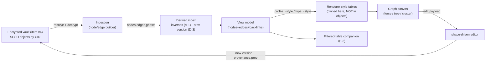
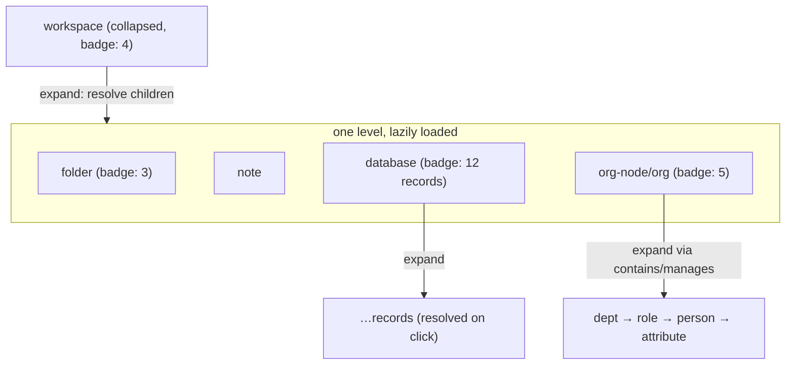
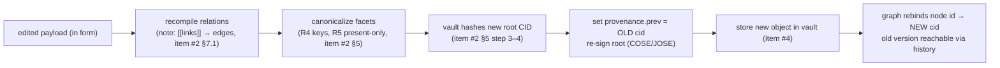
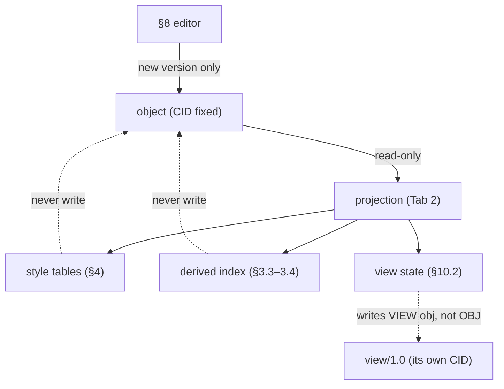

# 121XQ — Tab 2 Object-Graph Renderer & Editor (Projection Contract)

**Author:** Claude Code (design collaboration with Rashad Khan) · **Date:** 2026-08-20
**Status:** DESIGN / SPEC DRAFT — nothing here is built, wired, or deployed.
**Scope:** How Tab 2 turns the `relations` facet + object profiles into an interactive, editable
graph — data ingestion, the renderer-owned styling tables, drill-down, layout, interaction, the
`shape`-driven editor, backlinks, the filtered-table companion, and large-graph performance.
**Builds on:** `121XQ_RELATIONS_FACET_SPEC.md` (item **#2** — edge fields §2, core vocabulary §4,
canonicalization §5, inverse/backlink model §7, wikilink compilation §7.1, **renderer contract §10**;
decisions **D-1…D-5**), `121XQ_OBJECT_PROFILES_SPEC.md` (item **#3** — profile registry §2, narrowing
§3, renderer hints per profile; decisions **A-1…A-4**), `121XQ_AI_OS_SPEC_v5_SYNTHESIS.md` (Tab 2 §3,
Graphify/121ObjectMap render style, principles P9/P11/P12; decision **B-3**).
**Position in build order:** item **#5** of v5 §12 — the Tab 2 renderer/editor. Consumes items #2 and
#3; shares the store with item #6 (Tab 1) and reads the vault of item #4.

> **Honesty note (per user directive).** This is a *specification draft*, not an implementation. No
> renderer here is coded; the 121ObjectMap/Graphify view is referenced as the *intended host* for this
> projection, but nothing in this document is built, wired, or deployed. Status and hand-off are in §14.

> **Locked decisions inherited (2026-08-20, Rashad-approved) — normative here:**
> **D-1** Canonical CID = IPLD/multiformats; `data://sha256:<HASH>:<TYPE>` is a human-readable **alias**
> only (every example CID below is shown in alias form and says so).
> **D-3** `provenance.prev` is the sole version chain; the `prev-version` history edge is **derived by
> this renderer, never read from storage**.
> **D-4** Ambiguous wikilinks soft-resolve (+`props.ambiguous`); the renderer surfaces the flag, never
> hard-fails. **D-5** An empty `relations` facet is absent; the renderer treats absent as zero edges.
> **A-1** All inverses/backlinks are **derived by the index**, not stored. **A-4** `profile` (R6 URI) is
> authoritative for icon selection; `_type` is a derived convenience only.
> **B-3** v1 Tab 2 ships **graph view + filtered table**; board/calendar/rollups are phase 2.

---

## 1. Purpose & one-paragraph thesis

Tab 2 is a **pure projection** of the encrypted vault (P11, one store many views). It reads
content-addressed SCSO objects, lifts the node/edge set out of their `relations` facets exactly as item
#2 §10 defines, decorates each node/edge with **renderer-owned** style keyed off the object's `profile`
and each edge's `type`, and draws an interactive, drill-downable graph in the 121ObjectMap/Graphify
style. The **editor half** lets a user change a node's `payload` through a `shape`-driven form; saving
never mutates in place — it writes a **new content-addressed version** whose `provenance.prev` chains to
the old one (git-for-objects, v5 §3). The renderer invents no semantics and stores nothing in the
objects: restyling a node, re-laying-out the graph, or expanding a subtree never changes a single CID.
Everything the renderer adds — icons, colors, positions, backlinks, version edges — is derived at read
time and thrown away on reload. That is the whole contract: **the graph is the `relations` facet made
visible, and the visibility is disposable.**



---

## 2. Where Tab 2 sits (inputs, outputs, non-responsibilities)

| Concern | Owner | This renderer's relationship |
|---|---|---|
| Edge semantics (`type,to,dir,label,order,valid_time,weight`) | item #2 facet | **reads** (§10 contract); never writes new semantics |
| Node semantics (`payload`, allowed edges, drill-down edges) | item #3 profiles | **reads** the profile registry + renderer hints |
| Canonicalization / hashing / CIDs | item #2 §5 | **delegates** — calls the vault to hash a new version; never re-implements |
| Encryption / at-rest / offline | item #4 vault | **consumes** — asks the vault for plaintext facets it is entitled to |
| Icons, colors, sizes, layout, animation | **this renderer** | **owns** — the two style tables (§4) and all geometry |
| Backlinks, `prev-version`, inverse edges | **this renderer's index** | **derives** — never persisted (A-1, D-3) |
| Version write on save | item #2 §5 + item #4 | **orchestrates** — builds the new payload, delegates the hash + store |

**Non-responsibilities (explicit).** Tab 2 does not define edge types, does not mint profiles, does not
choose canonical encoding, and does not hold keys. It is a read-mostly lens with one write path (the
editor, §8), and that write path produces ordinary SCSO objects the rest of the system already
understands.

---

## 3. Data ingestion — from vault objects to a node/edge set

Ingestion is the deterministic lift from stored objects to an in-memory view model. It follows item #2
§10 to the letter and adds only *derived* structure.

### 3.1 Seeding the graph

The graph is **never** loaded whole (a vault can be enormous — §12). It opens from a **seed set** and
expands on demand:

- **Default seed:** the `workspace` root (item #3 §8) — the top of the `contains` tree.
- **Saved-query seed:** a `view` object with `kind=graph` supplies `graph_seed` + `edge_filter` (item #3
  §7.5). Tab 2's own graph *is itself a saved `view`* — see §10.
- **Focus seed:** any CID the user opens (from search, from Tab 1, from a backlink) becomes a seed with a
  default neighborhood radius (§7.6).

### 3.2 The lift (per item #2 §10)

For each resolved object `O` at CID `cid(O)`:

1. **Emit one node** with `id = cid(O)`, `profile = O.profile` (authoritative, A-4), `title =
   O.payload.title` (or a profile-specific fallback), `resolved = true`.
2. **For each edge `e` in `O.relations`** (absent facet ⇒ zero edges, D-5):
   - Emit a directed (or `dir=undirected`) edge `source = cid(O)`, `target = e.to`,
     `type = e.type`, carrying `label`, `order`, `weight`, `valid_time`, `props` as **data**.
   - If `e.to` is **not yet resolved** in the loaded set, emit a **ghost node** (§4.4) with `id = e.to`,
     `profile` guessed from the `:<TYPE>` alias suffix or `props.to_type` (item #2 §6), `resolved =
     false`. Ghosts are replaced by real nodes if/when the target is resolved on expand.
3. **Dedup nodes by CID.** The same CID seen as many edges' `to` is one node; edges are a multiset keyed
   by `(source,target,type,order?)`.

Pseudo-data (alias CIDs per D-1):

```jsonc
// after lifting a folder that contains two files (item #2 §11.1)
{
  "nodes": [
    { "id": "data://…:fold1:folder", "profile": "urn:121xml:folder/1.0", "title": "Runbooks", "resolved": true },
    { "id": "data://…:a1b2:file",    "profile": "urn:121xml:file/1.0",   "title": "SEV-1.md", "resolved": true },
    { "id": "data://…:e5f6:folder",  "profile": "urn:121xml:folder/1.0", "title": null, "resolved": false } // ghost, not yet expanded
  ],
  "edges": [
    { "source": "…fold1", "target": "…a1b2", "type": "contains", "order": 1, "dir": "directed" },
    { "source": "…fold1", "target": "…e5f6", "type": "contains", "order": 3, "dir": "directed" }
  ]
}
```

### 3.3 Derived inverses / backlinks (A-1, item #2 §7)

The renderer's **index** computes, for every loaded node `X`, the set of edges anywhere in the loaded
graph whose `target == X`. Each is presented **inverted** using item #2 §4's inverse column (an incoming
`references` shows as `referenced-by`; `contains` as `contained-by`; `reports-to` as `manages`). These
inverse edges are:

- **Derived, never stored** (A-1) — they exist only in the index and the backlinks panel (§9).
- **Symmetric-aware** — `same-as`/`related-to` (`dir=undirected`) appear from both ends without inversion.
- **Scope-limited to loaded data by default**, with an optional *global backlink query* against the
  vault's inverse index for the click-selected node (so backlinks are complete even for un-expanded
  regions — §9).

### 3.4 Derived `prev-version` history edges (D-3)

Version history is **not** an authored edge. For each loaded node `X` whose `provenance.prev` is present,
the renderer synthesizes a derived edge `X —prev-version→ prev(X)` (and the inverse `next-version`),
walking the `provenance.prev` chain lazily as far as the history panel needs (§8.4). These edges:

- carry a distinct **derived** style (§4.3, dashed, muted) so users never mistake them for authored
  relations;
- are **off by default** in the main canvas (they clutter), toggled on per-node in the info panel or via
  a global "show history" filter;
- are reconstructed every load from `provenance.prev` — the sole chain of record (D-3). No dual write,
  no drift.

```mermaid
graph LR
  X["note vN (cid 5e5e)"] -.prev-version (derived).-> P1["note vN-1 (cid 00aa)"]
  P1 -.prev-version.-> P2["note vN-2 (cid …)"]
  X -->|references (authored)| SEC["Security Policy"]
```

---

## 4. Node model & the renderer-owned styling tables

**The objects carry no visuals** (item #2 §10, P11). The two tables below live entirely in the renderer;
editing them restyles the graph and changes **no** CID.

### 4.1 The `profile → icon / color / category` table

Keyed off the node's authoritative `profile` URI (A-4); `_type` is used only as a human label. The
`category` column is the coarse grouping from item #3 §2 (the renderer may style by category and refine by
profile). Icons/colors below are **illustrative defaults** for red-line, not locked brand values.

| `profile` | category | icon (illustrative) | color role (illustrative) | shape |
|---|---|---|---|---|
| `workspace/1.0` | container (root) | 🏛️ vault | slate / accent ring | rounded-rect, largest |
| `folder/1.0` | container | 📁 folder | amber | rounded-rect |
| `file/1.0` | leaf | 📄 file | grey | rect |
| `note/1.0` | document | 📝 note | blue | rounded-rect |
| `database/1.0` | collection | 🗃️ table | teal | cylinder |
| `view/1.0` | lens | 🔍 lens | violet (dashed border = lens) | diamond |
| `record/1.0` | leaf | ▪️ row | teal-light | small rect |
| `org-node/1.0` | org | 👤/🏢 by `payload.kind` | green | circle |
| `agent/1.0` | agent | 🤖 agent | magenta | hexagon |
| `pipeline/1.0` | process | ⚙️ pipeline | orange | parallelogram |
| `model/1.0` | leaf | 📦 model | orange-light | rect |
| `dna-model/1.0` | leaf | 🧬 sequence | lime | rect |
| `standards.xml` (e.g. `iso20022/*`, `fhir/R4`) | document | 📑 standard | indigo | rounded-rect |
| *(unknown profile)* | fallback | ⬡ generic | neutral | circle |

**Resolution order for the icon (A-4):** `profile` URI → category default → `_type` label only for the
caption. `org-node` refines by `payload.kind` (org/dept/role/person/attribute) because one profile spans
five visual levels (item #3 §9). A **custom** profile with no table entry falls to the generic fallback
and is labelled by its URI's last segment.

### 4.2 The `edge-type → label / style / arrowheads` table

Keyed off `edge.type`; `dir` decides arrowheads (item #2 §10: `undirected` ⇒ none). `weight` (when
present) modulates stroke width as **data-driven** styling — still renderer-owned, the object stores only
the number. Styles below are illustrative.

| `edge.type` | display label | line style | arrowheads | drill-down? |
|---|---|---|---|---|
| `contains` / `contained-by` | "contains" | solid, heavy | ▶ to child | **yes** (primary hierarchy) |
| `reports-to` | "reports to" | solid | ▶ to manager | **yes** (org, up) |
| `manages` *(derived)* | "manages" | solid, muted | ▶ to report | **yes** (org, down) |
| `has-role` / `role-of` | "has role" | solid | ▶ | **yes** (org) |
| `references` / `referenced-by` | "references" | thin | ▶ (—by: ◀, derived) | no (lateral) |
| `cites` / `cited-by` | "cites" | thin, double | ▶ | no (lateral, P12) |
| `derived-from` / `derives` | "derived from" | dashed | ▶ to source | optional (lineage) |
| `owns` / `owned-by` | "owns" | solid, thick | ▶ | no |
| `instance-of` / `has-instance` | "instance of" | dotted | ▷ (open) | optional |
| `same-as` | "same as" | double, no arrow | none (undirected) | no |
| `related-to` | "related" | thin, muted | none (undirected) | no |
| `converted-from` / `converted-to` | "converted from" | dashed, indigo | ▶ | no (audit link) |
| `prev-version` / `next-version` *(derived, D-3)* | "prev version" | **dashed, faint** | ▶ to older | no (history overlay) |
| `urn:121xml:rel:<ns>/<name>` (custom) | vocab `label` or `<name>` | solid, opaque | ▶ | per `relation-vocab` |

**Custom edges (item #2 §4.1, D-2).** If the edge's `props.vocab` resolves to a `relation-vocab/1.0`
object (item #3 §4), the renderer uses its `label`, `dir`, and (if declared) a hierarchical hint;
otherwise it draws an **opaque directed edge labelled by the URI's `<name>`** — never guessing semantics.

### 4.3 Derived-edge styling (keep authored vs. derived legible)

Derived edges — backlinks (§3.3), `prev-version` (§3.4), and derived org inverses (`manages`, `role-of`
per A-1) — are drawn **muted and dashed** with a small "derived" glyph, so a user always sees the
difference between *what the object asserts* and *what the index computed*. This is a UI honesty rule, not
a data rule.

### 4.4 Ghost nodes (unresolved CIDs — item #2 §6, D-4/D-5)

A node is a **ghost** when its CID is referenced by an edge but not resolvable in the loaded set (dangling
target, not-yet-expanded target, or the reserved unresolved sentinel
`data://sha256:0…0:unresolved` from wikilink compilation, item #2 §7.1). Ghosts render with:

- a **dashed outline + reduced opacity**, icon guessed from the alias `:<TYPE>` suffix / `props.to_type`;
- the caption from `props.unresolved_title` (dangling wikilink) or the short CID;
- a **`props.ambiguous` badge** (D-4) when the wikilink soft-resolved to smallest-CID, with a hover nudge
  to disambiguate — surfaced, never auto-corrected;
- an **"expand/resolve" affordance**: clicking asks the vault to resolve the CID; success promotes the
  ghost to a real node in place (same `id`, so no layout jump).

---

## 5. Drill-down & hierarchy (expand / collapse)

Drill-down is a **transitive walk of hierarchical edge types** (item #2 §10; item #3 renderer hints), not
a separate tree structure. The hierarchy is whatever the profiles declare as drill-down edges.

### 5.1 Which edges are hierarchical

| Hierarchy | Driving edge(s) | Declared by |
|---|---|---|
| Workspace/Folder → children | `contains` (`order`-sorted) | item #3 §8/§12.1 |
| Database → records | `contains` | item #3 §6 |
| Org → Dept → Role → Person → Attribute | `contains`, `reports-to` (≤1), `manages`, `has-role` | item #3 §9 |
| Agent → sub-agents | `contains` | item #3 §10 |
| Pipeline → stages/sub-pipelines | `contains` | item #3 §11 |
| Model / dataset lineage | `derived-from` (optional expand) | item #3 §6/§11/§12.4 |

A profile's **renderer hint** (item #3, each §.6) names its drill-down edge(s); the renderer reads that
registry rather than hard-coding, so a new profile's hierarchy works without a renderer change.

### 5.2 Lazy expansion (the core loop)

Nodes start **collapsed** (a badge shows the count of hierarchical children, from the node's own
`contains`/hierarchical edges — known without resolving the children's *contents*). On expand:

1. Read the node's already-lifted hierarchical edges; for each child CID, **request that child object**
   from the vault (resolve + decrypt) — this is the point item #2 §10 calls "request the target's own
   `relations` facet on expand."
2. Lift each child (as §3.2), promoting any ghost to a real node, sorting siblings by `order` then
   canonical edge order (item #2 §5).
3. Attach children under the parent; do **not** recursively expand grandchildren (lazy — one level per
   expand). A child's own child-count badge tells the user whether more lies beneath.
4. Collapse is the inverse: hide the subtree, keep it cached, keep the parent's badge.



### 5.3 Cycle & depth safety

Containment should be acyclic, but `references`/`same-as` can create cycles and a malformed vault could
cycle `contains`. The expander tracks a visited-CID set on each path and **stops at a repeat**, drawing a
"↻ cycle" marker rather than looping. A configurable max auto-expand depth guards accidental fan-out.

---

## 6. Layout

Layout is pure geometry (renderer-owned); it never touches object data.

| Mode | When used | Notes |
|---|---|---|
| **Force-directed** (default) | general graph / neighborhood view | physics sim; derived + lateral edges as weak springs, hierarchical edges as strong springs; `weight` may scale spring strength |
| **Hierarchical / tree** (Reingold–Tilford / Sugiyama) | active drill-down of `contains`/`reports-to` | switches on when a subtree is expanded; org chart uses `reports-to`(≤1) up + `manages` fan-out down (item #3 §9.6) |
| **Cluster / grouped** | "cluster by profile" or "cluster by tag" toggled | nodes grouped into hulls by `profile` category (§4.1) or by `payload.tags`; inter-cluster edges bundled (§12) |
| **Radial / focus** | focus/neighborhood view (§7.6) | selected node centered, neighbors on rings by hop distance |

**Pinning.** A user can pin any node; pinned nodes are fixed points the force sim respects (others flow
around them). Pins are **UI state**, persisted in the Tab-2 `view` object's `payload` (as pinned CIDs +
coordinates), **not** in the graphed objects — so pinning a node changes the *view's* CID, never the
node's (P11). Layout seed/coordinates are likewise view state.

---

## 7. Interactions

### 7.1 Click → info panel

Selecting a node opens an info panel showing, read from the resolved object (no new data invented):

- **Header:** icon (from §4.1), `title`, `profile` URI (+ derived `_type`), short CID (copyable).
- **Payload preview:** rendered per profile (Markdown for `note`, field/value table for `record`,
  stage list for `pipeline`, etc.) — the read side of the §8 editor.
- **Edges out** (authored) and **edges in** (derived backlinks, §9), each row: type label, direction,
  target title/ghost, and `props`/`weight`/`valid_time` when present.
- **Provenance:** owner DID, signature indicator, and the **version history** walked from
  `provenance.prev` (D-3, §8.4).

Selecting an **edge** shows its full record (`type,to,label,dir,order,weight,valid_time,props`) — the raw
item #2 §2 fields, read-only (edges are edited by editing the source object's payload/links, §8.5).

### 7.2 Hover, multi-select

Hover reveals a node tooltip (title + profile + child-count) and highlights incident edges; hover on an
edge shows its type/label. Multi-select (shift-click / marquee) enables bulk filter-to-selection, bulk
pin, bulk "expand all," and "isolate subgraph" (hide everything else) — all view operations.

### 7.3 Filtering

Filters are **view predicates**, not data mutations. Available axes:

| Filter | Source field | Notes |
|---|---|---|
| by **profile / category** | node `profile` | e.g. show only `org-node`; maps to §4.1 |
| by **edge type** | `edge.type` | the `edge_filter` of a graph `view` (item #3 §7.1) |
| by **tag** | `payload.tags` (note/others) | multi-tag AND/OR |
| by **time** (`valid_time`) | edge `valid_time` + object time | "as of" a date hides edges whose interval excludes it; open-ended intervals (end absent = still valid, item #2 §2) stay visible |
| **resolved / ghost** | node `resolved` | e.g. hide ghosts, or show only dangling links to fix |
| **derived on/off** | edge derivation | toggle backlinks / `prev-version` overlays (§4.3) |

### 7.4 Search

- **Title / full-text search** over resolved objects' `payload.title` (and, where the vault index
  supports it, body text) → a ranked result list; picking a result **focuses** it (§7.6) and resolves it
  if it was a ghost.
- Search reuses the vault's **title→CID index** (the same index item #2 §7.1 uses for wikilink
  resolution) — no separate search store.

### 7.5 Time scrubbing (valid-time)

A time slider drives the `valid_time` filter (§7.3): dragging "as of" recomputes edge visibility so the
graph shows the org chart / relationships **as they were** at that instant — the temporal projection of
item #2's `valid_time`. This is read-only time travel over edges; object-version time travel is the
history panel (§8.4).

### 7.6 Focus / neighborhood view

"Focus" on a node re-seeds the graph to that CID and shows its **N-hop neighborhood** (default 1–2 hops),
radial layout (§6), everything else hidden. This is the antidote to whole-graph overload and the natural
landing when arriving from search, a backlink, or a Tab 1 deep-link.

---

## 8. The editor half — `shape`-driven editing with immutable versioning

Selecting **Edit** on a node opens a form; **saving writes a new content-addressed version.** Nothing is
mutated in place (P11, v5 §3).

### 8.1 Form generation from `shape` + `payload`

The form is generated, not hand-built, from two inputs the object already carries:

- the profile's **`payload` field table** (item #3, each §.1 — field name, type, required per R5); and
- the profile's **`shape`** facet (JSON Schema, item #2 §9 / item #3 §3) for validation (types, enums,
  patterns, required).

Mapping: `str` → text; long `str` like `payload_md` → Markdown editor; `bool` → toggle; `int`/`num` →
number; `enum` → select; `seq of str` → tag/chip input; `map`/`seq of map` → nested sub-forms. A
`record`'s fields come from its database's `record_shape` CID (item #3 §12.3), resolved and rendered the
same way. Required-vs-absent follows R5: an absent optional field stays absent (the form never emits an
explicit `null` placeholder).

### 8.2 Save = new version (the immutability flow)



Step by step:

1. **Assemble** the new `payload` from the form (present-only, R5).
2. **Recompile derived facets.** For a `note`, re-run wikilink compilation (item #2 §7.1) so `[[links]]`
   become `references` edges deterministically — including dangling-sentinel and ambiguity handling
   (D-4). Other profiles recompute nothing beyond their payload.
3. **Canonicalize** every facet (R4 sorted keys, R5 present-only) and let the **vault** compute the new
   root CID (item #2 §5). The renderer **delegates** hashing — it does not re-implement canonicalization.
4. **Chain provenance.** Set `provenance.prev` = the *old* object's CID (the sole version chain, D-3) and
   re-sign the new root (single COSE/JOSE signature over the root CID, item #2 §5 step 4).
5. **Store** the new object; the old one remains (immutable, dedup'd by CID).
6. **Rebind** the on-screen node's `id` from the old CID to the new CID; the old version is now reachable
   only through the history walk (§8.4). Because the node keeps its screen position, the edit is visually
   seamless — same node, new identity underneath (v5 §3: "the node updates in Tab 2").

**The renderer never mutates a stored object.** There is no in-place write path. A "rename" is a new
version; a "delete edge" is a new version whose `relations` omits that edge; even a pin is view state, not
an object edit (§6).

### 8.3 Editing edges

Edges are edited by editing their **source object**, because an edge lives inside the source's `relations`
facet (item #2 §1, implicit `from`):

- **Add a link:** in a `note`, typing `[[Target]]` in the Markdown editor adds a `references` edge on
  save (§8.2 step 2); for structured profiles, an "add relation" control appends a `{type,to}` edge
  constrained to the profile's Allowed-edges table (item #3) — the form only offers types the profile
  permits, and only targets whose profile matches the target constraint.
- **Retarget / remove:** editing or deleting the edge rewrites the source's `relations` and versions the
  **source**. The target is untouched (its CID is stable — this is exactly why inverses are derived, A-1).
- **Backlinks are not editable here** (they're derived, §9) — to change a backlink you edit the object
  that *asserts* the forward edge.

### 8.4 Version history (from provenance, D-3)

The info panel's history is the `provenance.prev` walk: `current → prev → prev → …`, each entry showing
its CID, owner, timestamp, and a **diff affordance** (payload/edge diff between adjacent versions,
computed by the renderer, not stored). Selecting an old version opens it **read-only** (you can view or
"restore as new version" — which is just another §8.2 save whose payload equals the old one). This is the
git-for-objects surface (v5 §3), and it exists **only** because `provenance.prev` is the chain of record;
the `prev-version` graph edge is the same walk drawn on the canvas (§3.4), never a second source of truth.

---

## 9. Backlinks panel (Obsidian-style, derived)

A dedicated panel (mirroring Obsidian's backlinks pane) lists, for the selected node `X`, **every edge in
the vault whose `to == cid(X)`**, inverted per item #2 §4 and grouped by inverse type:

- **Derived, never stored** (A-1) — computed from the vault's inverse index, not read off `X`.
- **Complete, not just on-screen** — the panel issues a *global* backlink query for the selected node
  (the neighborhood canvas may only show loaded backlinks; the panel shows all), so a note reveals every
  page that links to it even across un-expanded regions.
- **Grouped:** e.g. "Referenced by (7)", "Contained by (1)", "Managed by → reports-to (3)", "Same as
  (1)". Symmetric `same-as`/`related-to` appear regardless of authoring end.
- **Actionable:** clicking a backlink focuses (§7.6) the asserting object; there is no "edit backlink"
  (edit the forward edge on the asserting object, §8.3).

This panel and the canvas's derived in-edges are the **same index** rendered two ways (P11).

---

## 10. The filtered-table companion view (B-3) & graph-as-saved-query

Per **B-3**, v1 ships **graph view + a filtered table** over the *same* objects; board/calendar/rollups
are phase 2.

### 10.1 Table companion

- **Rows = the same node set** currently in scope (the seed/neighborhood/filter result). Toggling
  graph↔table never re-queries semantics — it re-renders the identical view model.
- **Columns = the profile's `shape` fields** (item #3 §.1 tables). For a homogeneous scope (one profile,
  e.g. all `record`s of a database) columns come from that database's `record_shape` (item #3 §6/§12.3);
  for a mixed scope, columns fall back to the common set (`title`, `profile`, `_type`, CID, edge-degree).
- **Filters/sort are shared** with the graph (§7.3) — the same predicate object drives both, so a filter
  set in the table narrows the graph and vice-versa.
- Selecting a row selects the node (shared selection); Edit from a row opens the same §8 form.

### 10.2 The graph itself is a saved `view` (`kind=graph`)

Tab 2's current graph **is a `view` object** with `kind=graph` (item #3 §7): its `graph_seed`,
`edge_filter`, active filters, layout mode, and pins serialize into the view's `payload`. Consequences:

- Saving a graph arrangement = writing/updating a `view` object (its own CID) — **restyle/relayout
  changes the view's CID, never any graphed object's CID** (P11, the separation-of-concerns payoff).
- A saved graph view is shareable and re-openable exactly like a table view; "graph" is a `view.kind`
  alongside `table`, not a separate mechanism (item #3 §13 fact 3).
- Because it's a saved query, the graph **recomputes** from the seed + filter each open (never a
  materialized, drift-prone subgraph).

---

## 11. Separation of concerns (why a restyle never changes a CID)

Restated as invariants the implementation must uphold (P11, item #2 §10):

1. **Style is a pure function of `(profile, edge.type, dir, weight)` → pixels**, evaluated at render
   time from the §4 tables. No style value is ever read from or written to an object facet.
2. **Derived structure (backlinks, `prev-version`, inverse org edges) lives only in the index**, rebuilt
   each load (A-1, D-3). Nothing derived is persisted onto the objects it decorates.
3. **View state (layout, pins, zoom, filters, seed) lives in the Tab-2 `view` object**, not in the graphed
   objects. Changing the view changes the *view's* CID only (§10.2).
4. **The only write to a graphed object is a new version via §8.2**, and that write is a semantic payload
   change the user made — never a styling or layout side-effect.

Therefore: two compliant renderers, given the same vault, draw the **same objects with the same CIDs** and
differ only in appearance; and re-theming 121ObjectMap tomorrow reissues zero object versions.



---

## 12. Performance — large-graph strategy

A vault graph can reach millions of objects; the renderer must never assume it fits.

| Technique | What it does | Ties to |
|---|---|---|
| **Seed + lazy expand** | never load the whole graph; resolve children only on expand (§5.2) | item #2 §10 "request target on expand" |
| **Viewport virtualization** | only nodes/edges within (or near) the viewport are in the scene graph; off-screen elements are culled | canvas/WebGL layer |
| **Level-of-detail (LOD)** | far/zoomed-out nodes render as dots/hulls (icons + labels drop out); detail returns on zoom-in | §4 style tables gated by zoom |
| **Edge bundling** | many parallel edges (e.g. dense `contains` or cross-cluster links) bundled into ribbons to cut visual + draw load | §6 cluster layout |
| **Cluster collapse** | a profile/tag cluster (§6) collapses to a single meta-node with a count badge; expands on click | §5 drill-down UX reused |
| **Incremental / async resolve** | child resolution is async + batched; ghosts show immediately, fill in as the vault returns (§4.4) | item #4 vault reads |
| **Index-backed backlinks/search** | backlinks (§9) and search (§7.4) hit the vault's inverse/title index, never a full scan | item #2 §7 / §7.1 |
| **Derived-edge budgets** | `prev-version` and backlink overlays are off by default and capped per node so history never explodes the scene (§3.4/§4.3) | D-3 |
| **Memoized layout** | force-sim results cached per view; pinned/settled subgraphs freeze to save cycles (§6) | view state (§10.2) |

Guiding rule: **work is proportional to what's on screen and what the user expands**, not to vault size.

---

## 13. End-to-end walkthrough (illustrative; alias CIDs per D-1)

1. **Open Tab 2.** Seed = workspace root `data://…:ws01:workspace`. Renderer lifts its four `contains`
   edges (item #3 §8.5) → four collapsed children with child-count badges; ghosts for any unresolved.
2. **Expand the org node.** Clicking `data://…:org0:org-node` resolves its `reports-to`/`has-role`/
   `contains` targets (item #3 §9) → tree layout kicks in (§6); `manages` fans downward as a **derived**
   dashed edge (A-1, §4.3).
3. **Focus a person.** Click "Jane Doe" → info panel shows payload (kind=person, attributes), out-edges
   (`reports-to`, `has-role`), and **derived backlinks** (§9): who reports to her (`manages`).
4. **Time-scrub.** Drag "as of" to 2023-06 → the `has-role` edge with `valid_time.start=2024-02-01`
   disappears (§7.5); the graph shows the earlier org state.
5. **Edit.** Open Jane's record's linked `note`, add `[[Comp Policy]]` in the Markdown editor. Save →
   wikilink compiles to a `references` edge (§8.3), new CID minted, `provenance.prev` chained (§8.2), node
   rebinds in place. If "Comp Policy" doesn't exist yet, a **ghost** appears with the dangling badge
   (§4.4).
6. **Switch to table (B-3).** Toggle to the filtered table (§10.1): the same in-scope objects as rows,
   `shape` fields as columns; filter "profile = org-node, kind = person" narrows both table and graph.
7. **Save the graph.** The current seed+filter+layout+pins persist into a `view` object (`kind=graph`,
   §10.2) — its **own** CID; not one graphed object changed identity.

---

## 14. Design decisions, judgment calls, and hand-off

### 14.1 Judgment calls made here (flagged for Rashad's red-line)

1. **Illustrative style tables, not locked values (§4).** I specified the *structure* of the
   `profile→icon/color/category` and `edge-type→style` tables and gave placeholder icons/colors. The
   actual glyph set and palette (and whether to key primarily off `category` or `profile`) are a design
   choice. **Red-line: adopt the 121ObjectMap/Graphify existing palette, or define fresh?**
2. **Derived-edge visual honesty rule (§4.3).** I chose to always draw backlinks / `prev-version` /
   derived org inverses in a muted dashed style so users distinguish asserted vs. computed. *Alternative:*
   render them identically to authored edges. Chosen for auditability (P12). **Keep?**
3. **`prev-version` off by default in the canvas (§3.4).** History edges clutter; I default them off,
   toggled per-node/globally. *Alternative:* always on. **Red-line.**
4. **Backlinks panel issues a global query, canvas shows only loaded (§9).** I split "complete backlinks
   in the panel" from "loaded backlinks on the canvas" to keep the canvas cheap while the panel stays
   truthful. *Alternative:* always resolve all backlinks into the canvas (expensive). **Confirm.**
5. **The Tab 2 graph *is* a `view/1.0` object (§10.2).** I bound layout/pins/filters/seed into the view's
   `payload` so "save my graph" has a home and never touches graphed objects. This assumes `view.payload`
   may carry renderer view-state (pins/coords). Item #3 §7.1 lists `graph_seed`/`edge_filter` but not
   pins/coords. **Red-line: extend `view/1.0` payload with optional `layout`/`pins` fields, or store
   Tab-2 view state elsewhere?**
6. **Editor delegates hashing to the vault (§8.2 step 3).** The renderer builds the new payload but does
   **not** re-implement canonicalization/CID — it calls item #2's canonicalizer via the vault. Chosen to
   keep one hashing implementation. **Confirm the API boundary (renderer ↔ vault) this implies.**
7. **`org-node` icon refines by `payload.kind` (§4.1).** One profile, five visual levels (person vs.
   role vs. dept…). *Alternative:* one org icon for all. Chosen so the drill-down chain reads clearly.
8. **Cycle handling stops at repeat-CID with a "↻" marker (§5.3).** A pragmatic guard; the alternative is
   forbidding cycles at validation time (item #3's shapes could, but don't yet). **Note for item #3.**

### 14.2 Dependencies & open external questions

- **Needs a renderer↔vault read API** (item #4): resolve-by-CID (batched, async), decrypt-entitled-facet,
  title→CID index, inverse (backlink) index. This spec assumes these exist; item #4 must expose them.
- **Needs the profile registry as data** (item #3 §2) so drill-down edges and payload/shape field tables
  are read, not hard-coded. If the registry ships as content-addressed `shape` objects, the renderer
  resolves them like any node.
- **`relation-vocab` resolution path (D-2).** §4.2 assumes the renderer can resolve `props.vocab` →
  `relation-vocab/1.0` to style custom edges; confirm vocab objects are reachable at render time.
- **Reuse vs. rebuild of 121ObjectMap/Graphify.** v5 §12 item #5 says "reuse the built 121ObjectMap/
  Graphify view." This spec is written so that view is the **host** for this projection, but I make **no
  claim** that the wiring exists — see status below. **Rashad to confirm the existing view's capabilities
  (LOD? WebGL? edit forms?) so §12/§8 map onto real affordances.**

### 14.3 Honest status

This is a **spec draft** — the Tab 2 renderer/editor *contract* on paper. **Nothing here is built, wired,
or deployed.** No renderer reads item #2's facet yet; no `shape`-driven form exists; the 121ObjectMap/
Graphify view is referenced as the intended host but is **not** claimed to be integrated, and no vault API
(item #4) is implemented. The style tables (§4) are **illustrative**, the walkthrough (§13) is
**hypothetical**, and every CID shown is an alias per D-1. External gates from the initiative memory
(GitHub org, HostArmada SSH, `121xq.com` DNS) are unchanged and unmet; nothing is deployed.

### 14.4 Hand-off (build order, v5 §12)

- **Consumes item #2** (`121XQ_RELATIONS_FACET_SPEC.md`): §10 node/edge contract, §4 vocabulary, §5
  canonicalization (for saves), §7/§7.1 inverse + wikilink model. Invents no edge semantics.
- **Consumes item #3** (`121XQ_OBJECT_PROFILES_SPEC.md`): §2 registry, per-profile renderer hints
  (drill-down edges) and `payload`/`shape` tables (editor forms). Invents no profiles.
- **Depends on item #4** (encrypted vault): the read API in §14.2 and the version-write/store path in §8.2.
- **Shares the store with item #6** (Tab 1): both are projections of the same objects; a Tab 1 edit and a
  Tab 2 edit are the same §8.2 versioning flow, so a change in one appears in the other (v5 §3, P11).

---

*Spec draft for red-line. Grounded in item #2's edge contract and item #3's profiles; honors D-1…D-5,
A-1/A-4, B-3, and principles P9 (graph-native), P11 (one store, many views), P12 (auditable AI). The Tab 2
renderer is a pure projection: it reads objects, derives inverses/history/backlinks at render time, owns
all styling in tables the objects never see, and writes only immutable new versions through the editor —
so restyling, relayout, and expansion change no object CID. Nothing here is built, wired, or deployed.*
