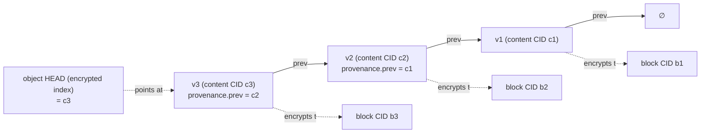
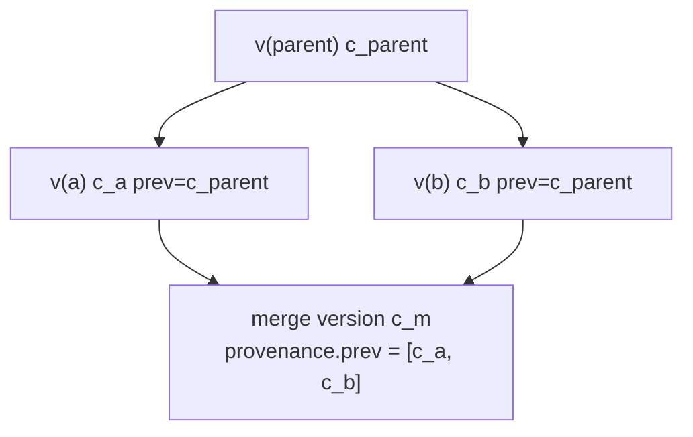

# 121XQ — The Encrypted Local-First Vault (L3.5 Storage Contract)

**Author:** Claude Code (design collaboration with Rashad Khan) · **Date:** 2026-08-20
**Status:** DESIGN / SPEC DRAFT — nothing here is built, wired, or deployed.
**Scope:** The content-addressed, encrypted, local-first object store (layer **L3.5**) that holds SCSO
objects: storage model, the two encryption modes, key management, at-rest encryption, secret handles,
offline operation + opt-in async E2E sync, client-side encrypted indexing, backup/export/crypto-delete,
and a per-mode threat model.
**Builds on:** `121XQ_AI_OS_SPEC_v5_SYNTHESIS.md` (layer L3.5 §2, privacy/local-first §4, locked product
decisions **B-1** encryption-vs-dedup and **B-2** async-collab), `121XQ_RELATIONS_FACET_SPEC.md` (item **#2**
— edge `to`=CID, canonicalization §5, **D-1** IPLD/multiformats canonical CID), `121XQ_OBJECT_PROFILES_SPEC.md`
(item **#3** — profiles, **A-3** secrets are *handles* not payloads), `121XML_v4_SEMANTIC_OBJECT_DESIGN.md`
(SCSO facets, Merkle-DAG root, `provenance` owner-DID/keys/signature, CBOR/JCS + multiformats, COSE/JOSE),
`121XML_AI_OS_FINAL_SPECIFICATIONS.md` (R4/R5/R7, existing §Security L5 AES-256-at-rest / TLS-1.3).
**Position in build order:** item **#4** of v5 §12. Consumes items #2 and #3; feeds item **#6** (Tab 1
workspace projections read/write through this store) and item #5 (Tab 2 renders the decrypted graph).

> **Honesty note (per user directive).** This is a *specification draft*, not an implementation. No vault,
> cipher, key schedule, index, or sync path here is coded, wired, or deployed. The AEAD/KDF choices are
> **design selections on paper**, not audited or benchmarked. Status and hand-off are stated in §14. Nothing
> claims to be "production ready."

> **Inherited locked decisions (2026-08-20, Rashad-approved) — normative here.**
> **B-1 (encryption vs. dedup, per-vault mode).** Default **private** = hash *ciphertext* under a per-vault
> key → dedup only *within* your own vault; operator sees only ciphertext + CIDs. Opt-in **shared/enterprise**
> = **convergent encryption** → cross-tenant dedup, accepting the documented **confirm-by-hash** tradeoff.
> This document implements **both** modes; addressing (D-1) is over the mode's chosen ciphertext input (§4).
> **B-2 (collaboration).** v1 ships **async** collaboration (exchange signed object versions; `provenance.prev`
> chain merges). Real-time CRDT co-editing is **phase 2** — out of scope here (§9).
> **D-1 (addressing).** Canonical content address = **IPLD/multiformats CID**; `data://sha256:<HASH>:<TYPE>`
> is a human-readable **alias** of the same hash. Every alias CID below is illustrative and says so.
> **A-3 (secrets boundary).** Secrets/keys/tokens **never** appear in signed, content-addressed payloads;
> an object holds a secret **handle** = a CID into this vault's secrets partition (§7). Confirmed boundary.

> **Proposed vault decisions V-1…V-8 (NOT yet approved — flagged for Rashad's red-line in §13).** This
> document has to make storage-crypto calls the source docs leave open. They are surfaced explicitly rather
> than smuggled in as normative: the two-plane CID model (V-1), all-encrypted-by-default facet policy (V-2),
> AES-256-GCM-SIV as the deterministic AEAD (V-3), the Argon2id→DID-bound key hierarchy (V-4), secrets are
> **always private-mode, never convergent** (V-5), HMAC-tagged client-side encrypted indexes (V-6),
> crypto-delete via key destruction (V-7), and the async head-fork conflict model (V-8).

---

## 1. Purpose & one-paragraph thesis

Items #2 and #3 fixed the **edges** and the **nodes**. This document fixes **where they live and how they
stay private**. The vault is the layer that turns "a content-addressed object model" into "a sovereign,
Proton-grade, local-first store": a blob store keyed by CID, whose blocks are AEAD-encrypted under
**user-held keys derived from the owner DID**, usable fully **offline**, with **opt-in, asynchronous,
end-to-end-encrypted sync**. The operator (any relay/host we or a partner runs) is *honest-but-curious by
assumption* and gets **zero access**: it stores ciphertext and CIDs and nothing else. The whole spec turns
on one reconciliation — the object's **semantic identity** (the plaintext CID that edges point at and
signatures cover, per items #2/#3) is deliberately kept distinct from its **storage address** (the ciphertext
CID that the operator sees and that B-1's dedup operates over). Everything else — key hierarchy, per-facet
encryption, secret handles, encrypted indexes, sync, crypto-delete, threat model — follows from getting that
two-plane model (V-1) right.

```mermaid
graph TD
  subgraph Device["ON-DEVICE VAULT (local-first, offline-capable)"]
    OBJ["SCSO object (plaintext)\npayload·shape·context·rules·relations·provenance·space"]
    OBJ -->|canonicalize R4/JCS-CBOR| PT["plaintext facet bytes"]
    PT -->|content CID = multihash(plaintext)| NAME["CONTENT CID (identity)\nedges.to · provenance.prev · signed"]
    PT -->|AEAD encrypt (mode: B-1)| CT["ciphertext block"]
    CT -->|block CID = multihash(ciphertext)| STORE["/blocks CAS (block CID → ciphertext)"]
    KR["wrapped keyring /keys"] -.unwraps.-> KEYS["object keys"]
    IDX["/index (client-side ENCRYPTED\ntitle→CID · backlinks)"]
    SEC["/secrets partition (A-3 handles)"]
  end
  STORE -.opt-in async E2E sync (B-2).-> RELAY["operator / relay\n(sees ciphertext + CIDs ONLY)"]
  NAME -.maps to.-> STORE
```

---

## 2. Storage model — a content-addressed block store

### 2.1 The two-plane CID model (V-1, the central reconciliation)

Encryption forces a fork in "the CID," because two questions have different answers:

- *"What is this object's name?"* — must be **mode-independent and stable**, or the same note would have a
  different identity in a private vs. a shared vault and every `relations.to`/`provenance.prev` edge would
  break the moment content is shared. This is the CID items #2/#3 mean by D-1.
- *"What block do I fetch/store/dedup?"* — must be over the **ciphertext**, because that is all the operator
  ever holds, and B-1 defines dedup over exactly this. This is the CID v5 §4 / B-1 mean by "hash ciphertext."

So the vault defines **two** IPLD/multiformats CIDs (both D-1-conformant; they address different bytes):

| Plane | Name | Hashed over | Used by | Mode-dependent? |
|---|---|---|---|---|
| **Semantic** | **Content CID** | canonical **plaintext** facet bytes (R4-sorted, deterministic CBOR/JCS — item #2 §5) | `relations.to`, `provenance.prev`, root manifest, the single COSE/JOSE signature | **No** — stable across modes |
| **Storage** | **Block CID** | the **ciphertext** block bytes (AEAD output incl. tag) | the `/blocks` CAS key; sync fetch/have sets; **dedup (B-1)** | **Yes** — differs by mode |

A per-vault, **client-side-encrypted map** `ContentCID → {BlockCID, wrapped object key, facet policy}` (the
*block map*, part of §8's index) is the only link between the planes. The operator never sees the content
CID — only block CIDs — so it cannot even name what it stores. This is the mechanism behind "operator sees
only ciphertext + CIDs" (B-1).

> **Reading D-1 in an encrypted store.** Both CIDs are IPLD CIDs. When items #2/#3 say `to`/`prev` is a CID,
> they mean the **content CID**. When B-1/v5 §4 say addressing is "over ciphertext," they mean the **block
> CID**. This document is the place that separates them; §13/V-1 flags it for red-line because the source
> docs use the single word "CID" for both.

### 2.2 What a stored block is

Each **facet** of each object version is encrypted and stored as one immutable block, keyed by its block CID
(large `file` payload bytes are chunked and stored as their own blocks — v4 §2 blob dedup). A block is:

```
BLOCK = [ cleartext header ‖ AEAD ciphertext(payload = canonical plaintext facet bytes) ]
```

The **cleartext header** is the *only* plaintext at rest (V-2). It is deliberately minimal and non-sensitive:

| Header field | Meaning | Why it must be cleartext |
|---|---|---|
| `v` | block format version | parse without a key |
| `mode` | `private` \| `shared` (B-1) | operator/peer must route dedup without decrypting |
| `aead` | AEAD id (e.g. `A256GCMSIV`) | agility; select cipher before key available |
| `kdf` | key-derivation id + params ref | locate the wrapping key |
| `wrap` | ref to the wrapped object key in `/keys` (private) **or** `convergent` sentinel (shared) | key resolution |
| `nonce` | AEAD nonce / SIV synthetic-IV tag | needed to decrypt; carries no plaintext |

Everything semantic — facet name, object type/profile, titles, edge targets, timestamps — lives **inside**
the ciphertext. The header leaks only *that a block exists, its size, and its mode* (residual leakage owned
in §12).

### 2.3 Objects, facets, versions, immutability

- An **object version** is the v4 Merkle-DAG root: a `provenance`-signed manifest over the R4-sorted list
  `{facetName: contentCID}`. The manifest is itself a facet-like block (encrypted; its own content/block CID).
- **Facets are stored once by content CID and shared** across versions and (mode-permitting) across objects —
  a note that changes only its `payload` reuses the identical `shape`/`context` blocks (v4 §2 dedup, now
  operating on block CIDs per mode).
- **Immutability:** a block is never mutated in place; editing produces new plaintext → new content CID →
  new ciphertext → new block CID. Nothing is overwritten (v4 §1; final-spec §Security L3).
- **The `provenance.prev` chain is the sole version history** (item #2 D-3): version *n* signs a `prev` =
  content CID of version *n-1*. The vault stores the chain as a set of immutable blocks; "history" is walking
  `prev`. There is no separate mutable "current" pointer inside a block — only per-object **heads** (§9.2),
  which live in the (encrypted) index, not in the signed object.



---

## 3. On-device layout

A vault is a directory tree (works on any local FS; sync is optional, §9). Illustrative layout:

```
<vault>/
  manifest.121            # encrypted vault manifest: id, owner DID, mode default, format versions
  blocks/                 # CAS: <blockCID> → BLOCK (cleartext header ‖ ciphertext). Content-addressed dedup.
    ba/bafy…kq3           # sharded by CID prefix
  keys/
    keyring.121           # wrapped object-key set (each OK wrapped under the Vault Key) — see §5
    recovery.121          # recovery-wrapped copy of the Master Key (opt-in, §5.5)
  index/                  # CLIENT-SIDE ENCRYPTED indexes (§8): block map, title→CID, backlinks, full-text
  secrets/                # secrets partition (A-3, §7): secret blocks under a distinct sub-key
  heads.121               # encrypted per-object HEAD set (§9.2)
  sync/                   # opt-in: have/want sets, peer refs, last-synced heads (§9)
```

Only `blocks/`, `secrets/` block bodies, `keys/*` (already wrapped), and the *ciphertext* of `index/` are
ever eligible to leave the device during sync — and every one of those is opaque to the operator. `manifest`,
`heads`, and index plaintext never leave un-encrypted.

---

## 4. The two encryption modes (implements B-1)

Both modes AEAD-encrypt the **same** canonical plaintext facet bytes and address the resulting block by the
**block CID = IPLD multihash over the ciphertext** (D-1, §2.1). They differ **only in which key encrypts**,
and that single difference is what produces the dedup/privacy tradeoff.

### 4.1 Private mode (default) — per-vault key, within-vault dedup

- **Object key:** `OK = HKDF(VaultKey, "obj" ‖ contentCID)` — deterministic, but **secret to the vault**
  (VaultKey is user-held, §5). Distinct vaults → distinct VaultKey → distinct OK → **distinct ciphertext for
  identical plaintext**.
- **Encryption:** `ct = AEAD_Enc(OK, plaintext, nonce = SIV(OK, plaintext))` using a **deterministic,
  nonce-misuse-resistant AEAD** (AES-256-GCM-SIV, V-3). Determinism is required so that *the same plaintext,
  encrypted twice in the same vault, yields the same block* → **within-vault dedup** (the block map, §2.1,
  finds the existing block CID).
- **What is hashed for the block CID:** `blockCID = multihash(sha-256( header ‖ ct ))` over the **vault-keyed
  ciphertext**. Because `ct` depends on `OK` which depends on the secret VaultKey, the block CID is
  **unlinkable across vaults**: two tenants storing the identical file produce different block CIDs, so the
  operator cannot tell they hold the same content, and cannot dedup across them.
- **Operator view:** ciphertext blocks + block CIDs + sizes only. **Total zero-access.**

### 4.2 Shared / enterprise mode (opt-in) — convergent encryption, cross-tenant dedup

- **Convergent object key:** `OK = HKDF( "121xq-convergent" ‖ plaintext )` — **derived from the plaintext
  itself**, no vault secret involved. Identical plaintext → identical `OK` **for every tenant**.
- **Encryption:** `ct = AEAD_Enc(OK, plaintext, nonce = SIV(OK, plaintext))` — same deterministic AEAD (V-3).
  Identical plaintext anywhere → identical `OK` → identical `ct`.
- **What is hashed for the block CID:** `blockCID = multihash(sha-256( header ‖ ct ))` over the
  **convergent ciphertext**. Identical plaintext → identical block CID **across all tenants** → the operator
  can store one physical copy and **dedup cross-tenant**. The per-object convergent key is then **wrapped to
  each authorized reader** (stored in `/keys`), so only holders of the wrap can decrypt — the operator still
  never gets a usable key.
- **Documented tradeoff — confirm-by-hash (V-5 boundary, §12).** Because the mapping *plaintext → block CID*
  is deterministic and keyless, an adversary (including the operator) who **guesses** a plaintext can compute
  its block CID and **confirm whether that exact content exists** in the store — and can see **which tenants
  share a block**. This is the inherent price of cross-tenant dedup and is why it is **opt-in** and why
  **secrets never use it** (§7, V-5). Mitigations: (a) restrict convergent mode to a **trust domain** via a
  shared *domain salt* folded into `OK` (`HKDF(domainSalt ‖ plaintext)`) so confirm-by-hash and dedup are
  scoped to that domain, not the whole operator population; (b) never place low-entropy or secret material in
  a shared-mode block.

### 4.3 Mode summary

| Property | Private (default) | Shared / enterprise (opt-in) |
|---|---|---|
| Object key source | `HKDF(VaultKey, contentCID)` (vault secret) | `HKDF([domainSalt ‖] plaintext)` (content-derived) |
| AEAD | AES-256-GCM-SIV (deterministic) | AES-256-GCM-SIV (deterministic) |
| **Bytes hashed for block CID** | header ‖ **vault-keyed ciphertext** | header ‖ **convergent ciphertext** |
| Dedup scope | **within one vault** | **cross-tenant** (or cross-domain if salted) |
| Operator can confirm-by-hash? | **No** | **Yes** (the accepted tradeoff) |
| Cross-vault block linkability | None | Equal content ⇒ equal block CID |
| Secrets partition allowed? | **Yes** | **Never** (V-5) |

D-1 is honored identically in both: the block CID is an IPLD multihash; the *input* is "the mode's chosen
ciphertext" (B-1). The **content CID (identity) is unchanged by mode** — a note keeps one name whether stored
privately or shared (that is why edges survive a share).

---

## 5. Key management

### 5.1 Root of trust — bind to the owner DID (provenance)

Ownership in SCSO is the `provenance` owner **DID + keypair** (v4 §2; v5 §4). The vault's key tree is
**bound to that DID** so "who owns the vault" and "who can decrypt it" are the same fact:

- The user holds a **DID keypair** (`did:key:z6Mk…`, the object signer).
- The **Master Key (MK)** is derived from a user secret and **bound to the DID**:
  `MK = Argon2id(passphrase, salt) ⊕ HKDF(did-secret, "121xq-mk")` (V-4). BYO variants replace the passphrase
  leg with a hardware token / OS keystore (§5.4). Argon2id makes an offline guess of a stolen at-rest vault
  expensive (device-thief mitigation, §12).
- MK never leaves the device and is never stored; it is re-derived on unlock and held in locked memory
  (secure enclave / OS keyring where available).

### 5.2 Key hierarchy (vault key → object keys)

```mermaid
graph TD
  DID["Owner DID keypair (provenance)"] --> MK["Master Key (MK)\nArgon2id(passphrase) ⊕ HKDF(DID)"]
  MK --> VK["Vault Key (VK)\nper vault"]
  MK --> SK["Secrets Key (SK)\nper vault, distinct branch (§7)"]
  MK --> IK["Index Key (IK)\nHMAC-tag + index encryption (§8)"]
  VK -->|HKDF(VK,'obj'‖contentCID)| OKp["Object Keys — PRIVATE mode"]
  PT["plaintext"] -->|HKDF(saltₒ‖plaintext)| OKc["Object Keys — SHARED/convergent"]
  VK -->|wraps| KR["keyring.121 (wrapped OKs / wrapped convergent keys)"]
  OKp --> BLK["AEAD block"]
  OKc --> BLK
```

- **MK** → **Vault Key (VK)**, **Secrets Key (SK)**, **Index Key (IK)** — separate HKDF branches so the
  three concerns rotate and delegate independently.
- **Object Keys (OK)** are per-object/per-facet: private-mode OKs derive from VK; convergent OKs derive from
  plaintext. Either way, the OK is **wrapped** (AES-KW / key-wrap) under VK and stored in `keyring.121`.
  Encrypting a facet touches one block; the *keyring* is the small hot thing.

### 5.3 Zero-access property (Proton-style)

The operator stores `blocks/`, wrapped `keys/`, and ciphertext `index/`. It holds **no** MK/VK/SK/IK and no
unwrapped OK. Without a user secret it cannot unwrap a single object key, so it cannot read any plaintext —
by construction, not by policy. Even in **managed** hosting (§5.4) the operator holds only a *recovery-wrapped*
MK it cannot itself unwrap. This is the L5 upgrade over the final-spec's "keys managed via environment
variables" (which the operator *could* read): here the operator **cannot** (V-4, §13 red-line).

### 5.4 BYO-key vs. managed

| | BYO-key (max sovereignty) | Managed (convenience, still zero-access) |
|---|---|---|
| MK custody | User only (passphrase + hardware token / OS enclave) | User unlocks; operator stores a **recovery-wrapped** MK it cannot unwrap |
| Operator can decrypt? | Never | Never (holds only opaque wrap) |
| Recovery if user loses secret | User's own backup only (§5.5) | Recovery flow (§5.5) — but recovery secret is still user/agent-held, not operator-held |
| Best for | Individuals, high-sensitivity vaults | Enterprise fleets wanting IT-assisted recovery without plaintext access |

### 5.5 Rotation & recovery

- **Rotation (cheap by design).** Rotating **VK** re-wraps the *keyring* (re-encrypts the wrapped OKs under
  the new VK) — it does **not** re-encrypt every block, because the OKs themselves are unchanged. Rotating an
  individual **OK** (e.g. after suspected exposure) re-encrypts only that object's blocks → new block CIDs;
  the content CID (identity) is unchanged, so edges still resolve. **Lazy re-encryption**: rotate-on-write
  is acceptable for large vaults.
- **Recovery.** Opt-in `recovery.121` stores MK wrapped under a **recovery secret**: a printed recovery
  phrase, a Shamir *k-of-n* split among the user's own devices/trustees, or an enterprise escrow that is
  **itself** a zero-access holder. No path lets the operator recover plaintext alone.
- **Crypto-delete interaction:** destroying an OK (and its keyring entry) makes its blocks permanently
  undecryptable — the basis of §11 crypto-delete (V-7).

---

## 6. At-rest encryption — what is and isn't encrypted

### 6.1 Policy: everything semantic is encrypted (V-2)

**Default: every facet's canonical bytes are AEAD-encrypted; the only plaintext at rest is the §2.2 block
header.** This includes `payload` **always** (v5 §4), and — unlike the final-spec's structure-only AES-at-rest
— also `relations` (graph topology is sensitive: who links to whom leaks the org/knowledge structure),
`provenance` body (owner DID + `prev` + signature are verified *after* decrypt by trusted parties; the
operator neither needs nor gets them), and `shape`/`context`/`rules`/`space`.

This is a deliberate departure from the tempting "keep `shape`/`context` cleartext so shared schemas dedup and
index cheaply." Cleartext `shape`/`context` would leak the *structure* of every object (that it is a
`pain.001`, an `org-node`, a patient record) — a serious metadata leak. So:

- **Default:** encrypt all facets. Shared-schema dedup still works — in **private mode** within your vault
  (identical `shape` block dedups), and in **shared mode** cross-tenant (convergent `shape` blocks converge).
  We do **not** need cleartext facets to get dedup.
- **Opt-in per-facet cleartext:** a vault MAY mark specific non-sensitive, dedup-heavy facets (typically a
  *published, already-public* `shape` or `context` profile) as cleartext to maximize cross-vault dedup in
  private mode. This is an explicit, logged privacy downgrade (§12 residual leakage), never a default.

### 6.2 AEAD choice (V-3)

- **AES-256-GCM-SIV (RFC 8452)** is the default AEAD for **both** modes. Rationale: dedup requires
  **deterministic** encryption (same plaintext+key → same ciphertext), and a plain random-nonce GCM would
  either break dedup (random nonce → different ciphertext) or be catastrophic under nonce reuse. GCM-SIV is
  **nonce-misuse-resistant** and safe under the deterministic/SIV nonce that dedup demands.
- **XChaCha20-Poly1305** is the registered alternative for platforms without AES hardware; when used for
  dedup it runs in an SIV construction (`nonce = HMAC(OK, plaintext)` truncated). AEAD agility via the header
  `aead` field (§2.2).
- Aligns with and upgrades final-spec L5 (AES-256 at rest) — same cipher family, now **user-keyed,
  per-object, deterministic-for-dedup**, and TLS 1.3 still covers transit.

### 6.3 Canonical example — a stored `note` block (illustrative)

Header is cleartext; body is opaque. Shown as annotated pseudo-CBOR; alias CIDs per D-1.

```jsonc
// BLOCK for the `payload` facet of note v3 (private mode)
{
  "header": {                       // CLEARTEXT (the only plaintext at rest)
    "v": 1,
    "mode": "private",
    "aead": "A256GCMSIV",
    "kdf":  "argon2id+hkdf/1",
    "wrap": "keyring:okref:7f31…",  // -> wrapped object key in keys/keyring.121
    "nonce":"siv:9b2c…"
  },
  "ct": "‹AES-256-GCM-SIV ciphertext of the canonical R4/CBOR bytes of›"
        // { "title":"Onboarding Runbook", "payload_md":"## Onboarding …", … }
}
// stored at: blocks/ba/bafyPRIVATEblockCID…    (block CID = multihash over header‖ct)
// content CID (identity, NOT stored in cleartext): data://sha256:5e5e…:note  (edges/prev/signature use this)
```

The `relations` facet of the same note (its compiled `[[wikilinks]]`, item #2 §7.1) is a **separate block**,
encrypted the same way; the operator sees two opaque blocks and cannot tell one is text and one is a graph.

---

## 7. Secret handles (implements A-3)

### 7.1 The boundary

Per A-3, **a secret is never in a signed payload**. Instead the object's payload carries a **handle** — a CID
into this vault's **secrets partition** (`secrets/`). The signed, content-addressed object contains only the
handle; the secret bytes live in a separately-keyed block the signature never covers.

- **Secret block:** an API key / token / private key stored as its own block under `secrets/`, encrypted under
  the **Secrets Key branch** `SK` (§5.2), addressed by a **secret handle** = its content CID.
- **Reference from an object:** a payload field holds the handle, e.g. `"api_key_ref":"data://sha256:se7c…:secret"`
  — a plain CID string, safe to sign and share because it reveals nothing (§14/#3 profiles: payloads are
  non-secret by construction).

### 7.2 Secrets are ALWAYS private-mode, never convergent (V-5)

A secret is, by definition, high-value and **must not** be confirm-by-hash-guessable. Convergent encryption
(§4.2) would let an adversary who guesses a token compute its block CID and confirm it. Therefore the secrets
partition is **hard-pinned to private mode** with a **random** per-secret key wrapped under `SK`
(`OK_secret = random(); wrap under SK`) — *not* the deterministic derivation used for dedup-eligible content.
Secrets are intentionally **not** dedup'd. This is a firm boundary (red-line V-5, §13).

### 7.3 Access control

- The secrets partition is unlocked by **SK**, a **distinct** MK branch from VK — so read access to normal
  objects can be granted (share VK-wrapped OKs) **without** granting secrets access (SK stays back). An agent
  or collaborator can read a `note` that *references* `api_key_ref` yet be unable to resolve the handle.
- Per-handle ACL: each secret block's wrapped key is wrapped to exactly the DIDs authorized to use it;
  resolving a handle = "do I hold a wrap for this handle under SK?" Revocation = drop the wrap and rotate.
- **Handle example** (a `pipeline` referencing a deploy token without embedding it; alias CIDs per D-1):

```xml
<map profile="urn:121xml:pipeline/1.0" version="1.0">
  <str name="_type">pipeline</str>
  <str name="title">Vendor-Risk Classifier</str>
  <map name="payload_secrets">
    <str name="deploy_token_ref">data://sha256:se7c…:secret</str>  <!-- HANDLE only (A-3) -->
  </map>
  <map name="provenance"><str name="owner">did:key:z6Mk…</str><str name="sig">cose:…</str></map>
  <str name="_address">data://sha256:pipe…:pipeline</str>
</map>
```

The signed object commits to the *handle*; the token itself is a random-keyed private block in `secrets/`,
resolvable only by SK-holders. The operator, and any reader without SK, sees an opaque CID.

---

## 8. Indexing over an encrypted store (V-6)

Wikilink resolution (item #2 §7.1, title→CID) and backlinks (item #2 §7, inverse index) both need indexes —
but a plaintext index at rest would defeat the whole vault. The vault therefore builds **client-side
encrypted indexes**: constructed on-device from decrypted content, stored encrypted, queried without
revealing plaintext to the operator.

### 8.1 Construction

- All indexes are built **locally**, from plaintext the device already decrypted. The operator never
  participates in indexing and never sees a term.
- Each index is encrypted under a branch of the **Index Key IK** (§5.2) and stored as ciphertext blocks in
  `index/`. On sync, only the ciphertext moves.

### 8.2 title→CID (wikilink resolution)

A searchable-symmetric-encryption style map keyed by **HMAC tags**, so a lookup needs no full decrypt and the
operator can't invert tags:

```
tag       = HMAC(IK_title, normalize(title))          // deterministic, keyed → operator can't reverse
posting   = AEAD_Enc(IK_title, contentCID [+ props.ambiguous, item #2 D-4])
index/title.121 : { tag → posting }
```

Wikilink `[[Security Policy]]` → compute `tag = HMAC(IK_title,"security policy")` → fetch and decrypt the
posting → `contentCID`. Ambiguity (multiple postings under one tag) is resolved smallest-content-CID +
`props.ambiguous`, exactly per item #2 D-4.

### 8.3 backlink / inverse index

For each target, an encrypted posting list of the sources that point at it (item #2 §7 derives inverses; the
vault is where the derivation is materialized, privately):

```
tag       = HMAC(IK_back, targetContentCID)
posting[] = AEAD_Enc(IK_back, { sourceContentCID, edgeType, inverseType })   // per incoming edge
index/backlinks.121 : { tag → posting[] }
```

Built by scanning each object's **decrypted** `relations` facet locally and appending an encrypted posting
under the target's tag. Tab 2 backlinks and the wiki read this; the operator sees only encrypted postings.
`prev-version` edges are **not** materialized (item #2 D-3) — history comes from `provenance.prev`.

### 8.4 Privacy implication (owned, not hidden)

HMAC tags hide titles/CIDs from the operator (keyed one-way), but a synced encrypted index still leaks
**access patterns and posting-list sizes** (how many things link to *something*, how often a tag is queried).
This is the standard searchable-encryption residual leakage; it is recorded in the threat model (§12), and a
fully offline vault leaks none of it (nothing syncs). No plaintext title or CID is ever at rest.

---

## 9. Local-first operation & opt-in async E2E sync (B-2)

### 9.1 Full offline operation

The vault is **complete on-device**: create/read/edit/version objects, compile wikilinks, resolve links,
render the Tab 2 graph, run local inference — all with **no network** (P8). Sync is a feature you may never
turn on. Cache/eviction for vaults larger than local disk:

- **Pinned** objects (the working set, plus anything the user marks) are never evicted.
- **Fetched-from-peer** blocks use **LRU** eviction keyed by block CID; an evicted block is re-fetchable by
  CID (content addressing makes eviction safe — the name still resolves).
- `file` payload chunks evict independently of their metadata block, so a large blob can be released while its
  `file` object stays resident.

### 9.2 Opt-in asynchronous E2E sync (B-2 — no real-time CRDT in v1)

Sync is **opt-in, end-to-end encrypted, and asynchronous**. The operator/relay is a **dumb encrypted block
store**: it accepts and serves blocks by block CID and holds no keys.

- **Signed-version exchange.** Because every version is immutable, signed, and content-addressed, sync is
  **append-only block transfer**: exchange `have`/`want` sets of block CIDs; push the ciphertext blocks the
  peer lacks; the peer verifies each object's COSE/JOSE signature **after decrypting** (trusted peers share
  the relevant wrapped OKs out-of-band or via a key-agreement channel). The operator never validates —
  it cannot — it only stores/serves opaque blocks.
- **`prev`-chain merge.** Each side tracks a per-object **HEAD** (a content CID, in the encrypted `heads.121`).
  Fast-forward: if my HEAD is an ancestor of yours along `provenance.prev`, adopt yours. No block is ever
  rewritten; merging is choosing/among heads.

### 9.3 Conflict handling (V-8) — fork, then explicit merge version

With async exchange and **no CRDT in v1** (B-2), concurrent edits produce **two version chains that share a
parent** (both have `prev = c_parent`). This is a **fork**, surfaced honestly rather than silently resolved:



- The vault detects a fork when an object has **two heads** descending from one parent.
- **Resolution is a new, signed merge version** whose `provenance.prev` lists **both** parents (a multi-`prev`
  merge, git-style). The merge content is produced by the user (or a Tab 1 assist), not auto-CRDT'd.
- Until merged, both heads are retained (immutability — nothing is lost); Tab 1 shows the conflict.
- **Real-time co-editing / CRDT on `payload` is explicitly phase 2** (B-2, v5 §4) and out of scope here.

> Multi-`prev` merge is a small extension to item #2's single-`prev` model; flagged in §13 (V-8) because
> items #2/#3 describe `provenance.prev` as a single CID — merges need it to accept a sequence.

---

## 10. Backup & export — a signed portable vault

- **Export** produces a self-contained bundle: all `blocks/` (or a selected object closure + its facet/edge
  transitive closure), the `keyring.121` (re-wrapped to the destination custody: the same MK, a new
  passphrase, or a recipient DID), the encrypted `index/`, and a **signed export manifest** (COSE over the set
  of included content CIDs + vault id + timestamp). Portability is free: content-addressing + `provenance`
  signatures make the bundle verifiable anywhere (v4 §1) and re-hydratable into any conformant vault.
- **Selective export / sharing** rides the same machinery: export one object's closure and wrap its OKs to the
  recipient DID — that *is* the async-share path (§9). Private-mode blocks stay unlinkable to the recipient's
  other content; shared-mode blocks dedup on arrival.
- **Backup** is just export to durable storage; because blocks are immutable and content-addressed, an
  incremental backup ships only new block CIDs since the last run.

---

## 11. Crypto-delete (V-7)

Content-addressed, replicated, immutable stores cannot guarantee erasure of every ciphertext copy — so the
vault deletes by **destroying the key, not the bytes**:

- **Delete one object version:** destroy its object key `OK` and remove the keyring entry → its blocks become
  **permanently undecryptable ciphertext** (crypto-shredded). The `provenance.prev` chain can retain the
  version's *existence* for audit while its *content* is unreadable.
- **Delete a whole vault / partition:** destroy VK (and/or SK for secrets) → the entire keyring is
  unrecoverable → every block is shredded at once. This is the "you hold the keys; revoke and it's gone" of
  v5 §4, made concrete.
- **Secrets** (§7) are single-key private blocks, so destroying the secret's `OK` is a clean, immediate shred
  — one reason secrets are never convergent (V-5).
- **Tension with immutability/audit (owned):** crypto-delete intentionally breaks *content* readability while
  the *chain* may persist. A vault chooses per-policy whether a shredded version's manifest block is also
  key-destroyed (full erasure, breaks the chain link's readability) or retained (auditable tombstone). Flagged
  §13.

---

## 12. Threat model (per mode)

What each adversary can and cannot learn. "Content" = any plaintext facet (payload, titles, edges, structure).

| Adversary | Private mode — CAN see | Private mode — CANNOT see | Shared mode — additionally |
|---|---|---|---|
| **Honest-but-curious operator / relay** | ciphertext blocks; block CIDs; **block sizes**; block `mode`; count of blocks; sync timing/frequency; encrypted index blobs + their **access patterns & posting sizes** (§8.4) | any content; titles; graph edges; object types/profiles; which blocks are equal **across vaults**; any key | **confirm-by-hash**: can test a *guessed* plaintext for presence (§4.2); can see **which tenants share identical blocks** (cross-tenant equality) |
| **Network attacker (in transit)** | TLS 1.3 ciphertext; traffic size/timing | plaintext; keys; signed content (integrity via COSE + TLS) | same equality/size leakage as it relays convergent blocks |
| **Device thief (has the at-rest vault)** | `blocks/`, wrapped `keys/`, ciphertext `index/`, headers | any content **without the user secret** — MK is Argon2id-hard + DID-bound (§5.1); wrapped OKs are useless without VK | same as private for at-rest; convergent blocks add confirm-by-hash *if* attacker also guesses plaintext |

Notes and hardening:

- **Unlocked-device thief** (device seized while VK is in memory) defeats at-rest crypto — mitigate with
  short **auto-lock** (drop MK/VK from memory), secure-enclave key custody, and requiring re-unlock for
  `secrets/`.
- **Private mode is the privacy-maximal default**: no cross-vault linkability, no confirm-by-hash. Choose it
  unless cross-tenant dedup economics are explicitly worth the confirm-by-hash exposure.
- **Shared mode's exposure is scoped** by the domain salt (§4.2): confine convergence to a trust domain so
  the leak is "members of this domain share content," not "anyone anywhere shares content."
- **Fully offline** eliminates every operator/network row: nothing syncs, so nothing leaks beyond the device.

---

## 13. Design decisions & judgment calls (flagged for Rashad's red-line)

Where the source docs did not fully determine a choice, this is what I chose and why. These are **proposals
(V-1…V-8), not yet approved**:

1. **V-1 — Two-plane CID model (content CID vs. block CID, §2.1).** The single biggest call. Items #2/#3
   compute and sign CIDs over **plaintext**; B-1/v5 §4 dedup over **ciphertext**. I split them: identity =
   plaintext content CID (stable, signed, what edges point at); storage = ciphertext block CID (mode-dependent,
   what the operator dedups). *Alternative:* one CID over ciphertext — but then a note's identity changes when
   shared and every edge breaks. **Red-line: confirm the split, and that `relations.to`/`provenance.prev` mean
   the content CID.**
2. **V-2 — Everything-encrypted-by-default; only the block header is cleartext (§6.1).** Departs from the
   final-spec's structure-only at-rest encryption and from "keep `shape`/`context` cleartext for dedup." I
   encrypt `relations` and `shape`/`context` too (topology and object-type are sensitive metadata), and get
   dedup from mode instead. **Red-line: accept the metadata-privacy-over-cheap-dedup default?**
3. **V-3 — AES-256-GCM-SIV as the deterministic AEAD (§6.2).** Dedup needs deterministic encryption; GCM-SIV
   is misuse-resistant and safe under the SIV nonce dedup requires. *Alternative:* random-nonce GCM (kills
   dedup) or plain convergent-with-CBC (fragile). **Red-line: cipher choice + XChaCha fallback.**
4. **V-4 — MK = Argon2id(passphrase) ⊕ HKDF(DID); operator-zero-access even when managed (§5.1, §5.3).**
   Upgrades final-spec L5 "keys in environment variables" (operator-readable) to keys the operator cannot
   read. **Red-line: binding MK to the DID secret vs. a fully independent passphrase-only MK.**
5. **V-5 — Secrets are ALWAYS private-mode, never convergent (§7.2).** Convergent on a secret enables
   confirm-by-hash guessing of the secret. Hard boundary. **Red-line: confirm secrets are never dedup'd.**
6. **V-6 — HMAC-tagged, client-side encrypted indexes (§8).** Enables title→CID and backlinks without
   plaintext at rest; accepts access-pattern/size leakage on *synced* indexes (none if offline). *Alternative:*
   fancier ORAM/PIR (heavier). **Red-line: is searchable-encryption residual leakage acceptable for v1?**
7. **V-7 — Crypto-delete via key destruction (§11).** The only honest "delete" for a replicated immutable
   CAS; trades bytes-erasure for key-erasure. **Red-line: default for shredded manifests — tombstone vs. full
   erase.**
8. **V-8 — Async fork + multi-`prev` merge version (§9.3).** Extends item #2's single-CID `provenance.prev` to
   accept a **sequence** at merge points. **Red-line: bless multi-`prev`, or model merges as a distinct
   object?** (Touches item #2's D-3 wording.)

---

## 14. Honest status & hand-off

**Status.** This is a **spec draft** — the vault *contract* on paper. No block store, cipher, key schedule,
index, sync path, or crypto-delete is implemented, wired, or deployed. AEAD/KDF selections (GCM-SIV, Argon2id,
HKDF, HMAC-tagged SSE) are **design choices**, not audited, benchmarked, or reviewed by a cryptographer — a
formal crypto review is a prerequisite before any implementation (noted as an external gate alongside the v5
GitHub/DNS/SSH gates). Nothing here claims to be production-ready.

**Consumes.**
- **Item #2 (relations).** `relations.to` and `provenance.prev` are **content CIDs** (V-1); the vault stores
  the encrypted `relations` facet as its own block and derives backlinks into an encrypted index (§8.3),
  honoring D-1…D-5 (esp. D-3: no stored `prev-version`).
- **Item #3 (profiles).** Payloads are non-secret by construction (A-3); secret **handles** (§7) are the
  vault-side of profiles' `*_ref` fields. Per-facet encryption policy (§6) applies uniformly to every profile.

**Feeds.**
- **Item #6 — Tab 1 workspace.** Every page/database/record edit is a vault write: canonicalize → new content
  CID → encrypt (mode) → new block CID → append `provenance.prev` → update the encrypted HEAD + indexes. Tab 1
  reads via decrypt-on-open and the title→CID/backlink indexes. **This is the primary hand-off.**
- **Item #5 — Tab 2 renderer.** Renders the **decrypted** graph; the block/content-CID split is invisible
  above L3.5 (the renderer sees content CIDs and edges exactly as item #2 specifies).
- **Item #7 — engine/privacy contract.** The zero-access property (§5.3) and local/offline inference (§9.1)
  are the storage-side guarantees the assistant's zero-retention contract composes with.

**External gates (unchanged from `121xq-aios-initiative` memory), plus one new:** GitHub org + `gh auth`,
real HostArmada SSH origin/key, `121xq.com` DNS — and **a formal cryptographic review of §4–§8 before any
code**. Nothing is deployed until Rashad opens these.

---

*Spec draft for red-line. Grounded in v4 SCSO (Merkle-DAG facets, `provenance` ownership, CBOR/JCS +
multiformats, COSE/JOSE) and the v5 synthesis (L3.5, Proton/Lumo privacy, B-1/B-2); consumes items #2/#3 and
honors D-1 (IPLD CID), A-3 (secret handles), B-1 (two encryption modes), B-2 (async, no v1 CRDT). The vault
adds no new SCSO facet: it is a storage + key + index layer under the object model. Two-plane CIDs keep object
identity mode-independent while dedup operates on ciphertext. Nothing here is built, keyed, indexed, synced,
or deployed.*
